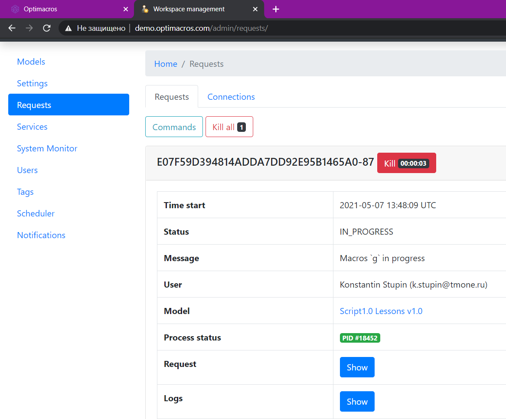

# Интерфейс Common

## Интерфейс Common<a name="common"></a>
```ts
interface Common {
	createCellBuffer(): CellBuffer;
	requestInfo(): RequestManager;
	modelInfo(): ModelInfo;
	userInfo(): UserInfo;
	resultInfo(): ResultInfo;
	entitiesInfo(): EntitiesInfo;
	copyData(): CopyData;
	apiServiceRequestInfo(): ApiService.RequestInfo | null;
	enterpriseLicenseManager(): EnterpriseLicenseManager;
}
```
Интерфейс, группирующий некоторые общие интерфейсы, не связанные друг с другом.

&nbsp;

```js
createCellBuffer(): CellBuffer
```
Возвращает ссылку на интерфейс [`CellBuffer`](#cell-buffer).

&nbsp;

```js
requestInfo(): RequestManager
```
Возвращает ссылку на интерфейс [`RequestManager`](#request-manager).

&nbsp;


```js
modelInfo(): ModelInfo
```
Возвращает ссылку на интерфейс [`ModelInfo`](#model-info).

&nbsp;

```js
userInfo(): UserInfo
```
Возвращает ссылку на интерфейс [`UserInfo`](#user-info).

&nbsp;

```js
resultInfo(): ResultInfo
```
Возвращает ссылку на интерфейс [`ResultInfo`](#result-info).

&nbsp;

```js
entitiesInfo(): EntitiesInfo
```
Возвращает ссылку на интерфейс [`EntitiesInfo`](#entities-info).

&nbsp;

```js
copyData(): CopyData
```
Возвращает ссылку на интерфейс [`CopyData`](#copy-data).

&nbsp;

```js
apiServiceRequestInfo(): ApiService.RequestInfo | null;
```
Возвращает ссылку на интерфейс [`ApiService.RequestInfo`](./apiService.md#request-info), если скрипт вызван через API Service, или `null` иначе.

&nbsp;

```js
enterpriseLicenseManager(): EnterpriseLicenseManager
```
Возвращает ссылку на интерфейс [`EnterpriseLicenseManager`](#enterprise-license-manager).

&nbsp;

### Интерфейс RequestManager<a name="request-manager"></a>
```ts
interface RequestManager {
	log(message: string, print?: boolean): RequestManager;
	logStatusMessage(message: string, print?: boolean): RequestManager;
	setStatusMessage(message: string): RequestManager;
}
```
Интерфейс для записи в лог (устаревший функционал) и работы со статусными сообщениями. Все функции возвращают `this`.

&nbsp;

```js
log(message: string, print?: boolean): RequestManager
```
Выводит сообщение `message` в лог, доступ к которому можно получить в панели администратора. Если `print === true` (по умолчанию: `false`), дублирует сообщение `message` в консоль и дополнительно переносит курсор на новую строку. *Устаревшая функция.*



&nbsp;

<a name="request-manager.log-status-message"></a>
```js
logStatusMessage(message: string, print?: boolean): RequestManager
```
Делает то же, что и `setStatusMessage()`. Если `print === true` (по умолчанию: `false`), дублирует сообщение `message` в консоль и дополнительно переносит курсор на новую строку. *Устаревшая функция.*

&nbsp;

<a name="request-manager.set-status-message"></a>
```js
setStatusMessage(message: string): RequestManager
```
Устанавливает статусное сообщение `message`. Может использоваться для уведомления пользователя во время длительной работы скрипта об этапах или процентах выполненных работ.


&nbsp;

### Интерфейс CellBuffer<a name="cell-buffer"></a>
```ts
interface CellBuffer {
	set(cell: Cell | CubeCell, value: number | string | null): CellBuffer;
	apply(): CellBuffer;
	count(): number;
	canLoadCellsValues(value: boolean): CellBuffer;
}
```
Буфер, куда можно временно поместить значения набора ячеек, не обязательно смежных, чтобы изменить их перед отправкой на сервер.

В один буфер можно помещать запросы на изменение ячеек, принадлежащих разным представлениям одного объекта (мультикуба или справочника) и даже разным объектам. Однако в последнем случае следует понимать, что если между объектами (например, мультикубами `мк1` и `мк2`) существует связь, которая может привести к пересчёту значений, то последовательность действий

```
* запись в `CellBuffer` ячеек `мк1`
* запись в `CellBuffer` ячеек `мк2`
* вызов `CellBuffer.apply()`
```

и последовательность

```
* запись в `CellBuffer` ячеек `мк1`
* вызов `CellBuffer.apply()`
* запись в `CellBuffer` ячеек `мк2`
* вызов `CellBuffer.apply()`
```

может привести к различным результатам.

При модификации большого количества клеток (от нескольких сотен тысяч), рекомендуется пользоваться [`импортом CSV`](./exportImport.md#importer).

&nbsp;

```js
set(cell: Cell | CubeCell, value: number | string | null): CellBuffer
```
Устанавливает значение `value` в клетку `cell` в буфере. Возвращает `this`.

&nbsp;

<a name="apply"></a>
```js
apply(): CellBuffer
```
Передаёт на сервер значения всех клеток для присваивания в модели и очищает буфер. Перед присваиванием сервер может их обработать и выставить другие значение, например, после установки в ячейку формата даты строки `'2019-03-01'` впоследствии из неё будет считана строка `'1 Mar 19'`. Возвращает `this`.

&nbsp;

```js
count(): number
```
Возвращает количество ячеек в буфере.

&nbsp;

```js
canLoadCellsValues(value: boolean): CellBuffer
```
Устанавливает значение `value`, указывающее, нужно ли перезагружать значения клеток в буфере, если они изменятся. Возвращает `this`.

По умолчанию: `true`. Использование значения по умолчанию сохранено для обратной совместимости и приводит к снижению производительности. Рекомендуется сразу после инициализации объекта вызвать функцию canLoadCellsValues и передать ей значение `false`.

&nbsp;

### Интерфейс ExportObfuscationState<a name="export-obfuscation-state"></a>
```ts
interface ExportObfuscationState {
	setPath(path: string): ExportObfuscationState;
	setEmailWhiteList(emailWhiteList: string[]): ExportObfuscationState;
	setDataArchiveType(type: string): ExportObfuscationState;
	export(): boolean;
}
```
Интерфейс для экспорта модели в [`обфусцированном`](https://ru.wikipedia.org/wiki/%D0%9E%D0%B1%D1%84%D1%83%D1%81%D0%BA%D0%B0%D1%86%D0%B8%D1%8F_(%D0%BF%D1%80%D0%BE%D0%B3%D1%80%D0%B0%D0%BC%D0%BC%D0%BD%D0%BE%D0%B5_%D0%BE%D0%B1%D0%B5%D1%81%D0%BF%D0%B5%D1%87%D0%B5%D0%BD%D0%B8%D0%B5)) состоянии. Используется для передачи моделей, содержащих конфиденциальную информацию, третьим лицам.

&nbsp;

```js
setPath(path: string): ExportObfuscationState
```
Устанавливает путь к файлу модели. Возвращает `this`.

&nbsp;

```js
setEmailWhiteList(emailWhiteList: string[]): ExportObfuscationState
```
Устанавливает список email пользователей модели, которые *не* будут обфусцированы. Возвращает `this`.

&nbsp;

```js
setDataArchiveType(type: string): ExportObfuscationState
```
Устанавливает тип формата выгруженных данных модели. Допустимые значения: `TXT`, `BIN`. Значение по умолчанию: `BIN`. Возвращает `this`.

&nbsp;

```js
export(): boolean
```
Экспортирует модель и возвращает `true`.

&nbsp;

### Интерфейс ModelInfo<a name="model-info"></a>
```ts
interface ModelInfo {
	id(): string;
	name(): string;
	lastSyncDate(): number;
	
	autoCalcStatus(): boolean;
	setModelCalculationMode(status: boolean): boolean;
	
	repair(): boolean;
	recalculate(): boolean;
	backup(path: string): EntityInfo | boolean;
	
	export(path: string): boolean;
	exportObfuscationState(): ExportObfuscationState;
	
	useUniqueLock(): this;
	useSharedLock(): this;
	hasSharedLock(): boolean;
	hasUniqueLock(): boolean;
	unlock(): this;
	
	recalculateIfManualCalculable(identifiers: number[]): boolean;
	getStorageInstancePriority(): number;
	setStorageInstancePriority(priority: number): number;
}
```
Интерфейс получения информации о модели и произведения с ней некоторых манипуляций.

&nbsp;

```js
id(): string
```
Возвращает `id` модели.

&nbsp;

```js
name(): string
```
Возвращает имя модели.

&nbsp;

```js
lastSyncDate(): number
```
Возвращает дату и время в формате [`UNIX`](https://ru.wikipedia.org/wiki/Unix-%D0%B2%D1%80%D0%B5%D0%BC%D1%8F) последнего пересчёта модели в ручном режиме.

&nbsp;

```js
autoCalcStatus(): boolean
```
Возвращает признак режима автоматического пересчёта модели.

&nbsp;

```js
setModelCalculationMode(status: boolean): boolean
```
Устанавливает признак режима автоматического пересчёта модели. Аналог в интерфейсе Optimacros: меню пользователя -> `Параметры` -> `Расширенные` -> `Режим ручного пересчёта модели`. Возвращает `true`.

&nbsp;

```js
repair(): boolean
```
Делает резервную копию модели, останавливает все [`процессы`](https://ru.wikipedia.org/wiki/%D0%9F%D1%80%D0%BE%D1%86%D0%B5%D1%81%D1%81_(%D0%B8%D0%BD%D1%84%D0%BE%D1%80%D0%BC%D0%B0%D1%82%D0%B8%D0%BA%D0%B0)) ОС, которые обслуживают модель, запускает их заново и восстанавливает модель из копии. Аналог в интерфейсе Optimacros: меню пользователя -> `Перезапустить модель`. Возвращает `true`.

&nbsp;

```js
recalculate(): boolean
```
Выполняет пересчёт модели в ручном режиме. Не останавливает процессы модели, за счёт чего выполняется значительно быстрее, чем `repair()`. Аналог в интерфейсе Optimacros: меню пользователя -> `Пересчитать модель`. Возвращает `true`.

&nbsp;

```js
export(path: string): boolean
```
Сохраняет резервную копию в [`рабочую директорию`](../appendix/glossary.md#script-dir) скрипта по пути `path`. Возвращает `true`.

&nbsp;

```js
backup(path: string): EntityInfo | boolean
```
Сохраняет резервную копию в логах модели ->`Центр безопастности`->`Логи`->`Резервные копии`. Если указан путь `path`, после создания копии вызовется функция `export()` и вернётся её результат типа `boolean`. Если `path` не указан, возвращает сущность резервной копии в виде [`EntityInfo`](./views.md#entity-info).

&nbsp;

```js
exportObfuscationState(): ExportObfuscationState
```
Возвращает интерфейс [`ExportObfuscationState`](#export-obfuscation-state) экспорта модели в обфусцированном состоянии.

&nbsp;

```js
useUniqueLock(): this
```
Устанавливает режим блокировки модели скриптом (`Lock Mode`) `Unique`. Необходим для изменения метаданных модели. В таком режиме одномоментно может испольняться только один запрос (работающий скрипт или пользователь), остальные будут стоять в очереди. Подробнее о режимах блокировки [здесь](../advancedFeatues/modelLock.md).

&nbsp;

```js
useSharedLock(): this
```
Устанавливает режим блокировки модели скриптом (`Lock Mode`) `Shared`. Достаточен для чтения данных из модели и изменения значений кубов. В один момент может исполняться несколько запросов от скриптов и пользователей с таким режимом блокировки. Попытка изменения метаданных будет вызывать ошибку `Unique lock not defined`. Подробнее о режимах блокировки [здесь](../advancedFeatues/modelLock.md).

&nbsp;

```js
hasSharedLock(): boolean
```
Находится ли модель под `shared` блокировкой. Если скрипт находится вне контекста модели (режим запуска `Custom` или использован метод `unlock()`), то вернёт `false`.

&nbsp;

```js
hasUniqueLock(): boolean
```
Находится ли модель под `unique` блокировкой. Если скрипт находится вне контекста модели (режим запуска `Custom` или использован метод `unlock()`), то вернёт `false`.

&nbsp;

```js
unlock(): this
```
Устанавливает режим блокировки модели скриптом (`Lock Mode`) `Custom`. Скрипт перестанет отображаться в очереди модели (также перестанет отображаться плашка с информацией от скрипта!). Методы, связанные с моделью, будут вызывать ошибку `Model not defined`. Подробнее о режимах блокировки [здесь](../advancedFeatues/modelLock.md).

&nbsp;

```js
recalculateIfManualCalculable(identifiers: number[]): boolean
```
Производит перерасчёт сущностей, если на них не стоит флаг автокалькуляции. Автоматически перерасчитываемые сущности пропускаются. При успешном перерасчёте возвращает `true`.

&nbsp;

```js
getStorageInstancePriority(): number;
```
Возвращает текущий приоритет OLAP-процесса модели — значение [nice](https://ru.wikipedia.org/wiki/Nice), число от `-20` (наивысший приоритет) до `+19` (наименьший приоритет).

&nbsp;

```js
setStorageInstancePriority(priority: number): number;
```
Устанавливает приоритет OLAP-процесса модели (значение [nice](https://ru.wikipedia.org/wiki/Nice)). В параметре принимает число от `0` до `19`, отрицательные значения не разрешены. Возвращает предыдущее значение приоритета.

<details><summary>Дополнительно о приоритете процесса</summary>
&nbsp;
<p>
По умолчанию большинство процессов в системе имеют приоритет 0.
</p>
<p>Если OLAP-процесс (процесс БД, хранящей и вычисляющей данные) одной из моделей воркспейса потребляет значительно больше ресурсов, чем остальные процессы, это может приводить к видимому замедлению работы в других моделях на том же воркспейсе или любых других процессов, использующих те же ресурсы. Чтобы подправить эту ситуацию, можно установить для OLAP-процессов моделей разные приоритеты (то есть, подвинуть их в очереди на получение ресурсов процессора). Если установить OLAP-процессу модели приоритет ниже (чиcло выше), то она будет пропускать в очереди другие процессы и, хоть и работать медленнее, но не мешать работе в остальных моделях.
</p>
</details>

&nbsp;

### Интерфейс UserInfo<a name="user-info"></a>
```ts
interface UserInfo {
	getEntity(): EntityInfo;
	getEmail(): string;
	getFirstName(): string;
	getLastName(): string;
	getRole(): EntityInfo;
}
```
Интерфейс получения информации о пользователе.

&nbsp;

```js
getEntity(): EntityInfo
```
Возвращает сущность пользователя в виде [`EntityInfo`](./views.md#entity-info).

&nbsp;

```js
getEmail(): string
```
Возвращает email пользователя.

&nbsp;

```js
getFirstName(): string
```
Возвращает имя пользователя.

&nbsp;

```js
getLastName(): string
```
Возвращает фамилию пользователя.

&nbsp;

```js
getRole(): EntityInfo
```
Возвращает сущность роли пользователя в виде [`EntityInfo`](./views.md#entity-info).

&nbsp;

### Интерфейс ResultInfo<a name="result-info"></a>
```ts
interface ResultInfo {
	addFileHash(hash: string): ResultInfo;
	actionsInfo(): ResultActionsInfo;
	setProperty(name: string, value: any): ResultInfo;
}
```
Интерфейс управления ответом на запрос о запуске скрипта.

&nbsp;

<a name="result-info.add-file-hash"></a>
```js
addFileHash(hash: string): ResultInfo
```
Добавляет к ответу на запрос скрипта хэш `hash` файла, ранее зарегистрированного в [`глобальном реестре`](../appendix/glossary.md#global-file-registry). Для пользователя это приведёт к тому, что файл будет скачан в браузере. Возвращает `this`.

&nbsp;

```js
actionsInfo(): ResultActionsInfo
```
Возвращает интерфейс [`ResultActionsInfo`](./scriptChains.md#result-actions-info) создания действий, которые можно автомагически осуществить после исполнения текущего скрипта.

&nbsp;

```js
setProperty(name: string, value: any): ResultInfo
```
Устанавливает свойству `name` значение `value` в HTTP-ответе на запрос о запуске скрипта приложением-клиентом (например, web-интерфейсом Optimacros). Возвращает `this`.

&nbsp;

### Интерфейс EntitiesInfo<a name="entities-info"></a>
```ts
interface EntitiesInfo {
	get(longId: number): EntityInfo | null;
	getCollection(longId: number[]): EntityInfo[];
}
```
Интерфейс для получения сущности по [`longId`](./views.md#long-id).

&nbsp;

```js
get(longId: number): EntityInfo | null
```
Возвращает сущность [`EntityInfo`](./views.md#entity-info) по её [`longId`](./views.md#long-id).

&nbsp;

```js
getCollection(longId: number[]): EntityInfo[]
```
Возвращает массив сущностей [`EntityInfo`](./views.md#entity-info) по массиву их [`longId`](./views.md#long-id).

&nbsp;

### Интерфейс CopyData<a name="copy-data"></a>
```ts
interface CopyData {
	setSourceLongId(longId: number): CopyData;
	setDestLongId(longId: number): CopyData;
	enableCustomProperties(): CopyData;
	enableCopyAllCubes(): CopyData;
	setMulticubeLongIds(longIds: number[]): CopyData;
	setMulticubeByNames(names: string[]): CopyData;
	copy(): CopyData;
}
```
Интерфейс, реализующий шаблон проектирования [`строитель`](https://ru.wikipedia.org/wiki/%D0%A1%D1%82%D1%80%D0%BE%D0%B8%D1%82%D0%B5%D0%BB%D1%8C_(%D1%88%D0%B0%D0%B1%D0%BB%D0%BE%D0%BD_%D0%BF%D1%80%D0%BE%D0%B5%D0%BA%D1%82%D0%B8%D1%80%D0%BE%D0%B2%D0%B0%D0%BD%D0%B8%D1%8F)), позволяет скопировать срез куба в другой куб внутри одного мультикуба. Для указания кубов, которые необходимо копировать, необходимо вызвать одну из трёх функций: `enableCopyAllCubes()`, `setMulticubeLongIds()`, `setMulticubeByNames()`. Все методы возвращают `this`.

&nbsp;

```js
setSourceLongId(longId: number): CopyData
```
Устанавливает [`longId`](./views.md#long-id) измерения источника.

&nbsp;

```js
setDestLongId(longId: number): CopyData
```
Устанавливает [`longId`](./views.md#long-id) измерения приёмника.

&nbsp;

```js
enableCustomProperties(): CopyData
```
Предписывает пройти по всем справочникам, которые имеют связь с источником и приёмником, и произведёт копирование пользовательских свойств.

&nbsp;

```js
enableCopyAllCubes(): CopyData
```
Предписывает произвести копирование во всех кубах.

&nbsp;

```js
setMulticubeLongIds(longIds: number[]): CopyData
```
Устанавливает [`longId`](./views.md#long-id) мультикубов.

&nbsp;

```js
setMulticubeByNames(names: string[]): CopyData
```
Устанавливает имена мультикубов.

&nbsp;

```js
copy(): CopyData
```
Выполняет копирование.

&nbsp;

### Интерфейс EnterpriseLicenseManager<a name="enterprise-license-manager"></a>
```ts
interface EnterpriseLicenseManager {
	getWorkspaceLicenseStatus(): boolean;
	getWorkspaceLicenseInfo(): object;
		
	createKey(password: string): string;
	validateKey(password: string, key: string): boolean;
	
	validateLicenseJson(jsonStr: string): boolean;
	createLicense(password: string, key: string, jsonStr: string): string;
	validateLicense(password: string, key: string, licenseData: string, id?: string | null): object;
}
```
Интерфейс для работы с лицензиями воркспейса: получения информации об установленной на воркспейсе лицензии, создании шифрованной лицензионной строки и её валидации. Текст лицензии — `JSON`-строка, содержащая произвольную информацию. Документации на поля этого `JSON` на данный момент нет, но основное, что там должно содержаться, — информация об объекте лицензирования (домене, на котором будет развёрнут воркспейс) и допустимых параметрах воркспейса (число моделеров, число обычных пользователей и т. п.).

Для создания лицензии требуется пароль (произвольная строка) и ключ, сгенерированный на основе этого пароля. Далее текст лицензии шифруется с помощью пароля и ключа. Опционально можно добавить идентификатор, который будет отображаться в панели администратора вместе с лицензией. После этого пароль и ключ зашиваются в дистрибутив, который будет установлен на сервере клиента, а зашифрованная лицензия передаётся клиенту и должна быть введена в панели администратора воркспейса в специальное поле в настройках воркспейса.

&nbsp;

```js
getWorkspaceLicenseStatus(): boolean
```
Если на воркспейсе в панели администратора установлена лицензия, соответствующая зашитым в дистрибутив паролю и ключу, возвращает `true`. В противном случае возвращает `false`.

&nbsp;

```js
getWorkspaceLicenseInfo(): object
```
Если на воркспейсе установлена валидная лицензия, возвращает стандартный JS-объект с полями, указанными в исходной структуре лицензии. В случае отсутствия лицензии выбрасывается исключение `License not valid`.

&nbsp;

```js
createKey(password: string): string
```
Создаёт ключ на основе пароля `password`, которым можно в дальнейшем подписать лицензию. Повторный вызов приводит к генерации нового ключа.

&nbsp;

```js
validateKey(password: string, key: string): boolean
```
Проверяет ранее созданный ключ `key` на соответствие паролю `password`. Возвращает `true`, если проверка пройдена, иначе выбрасывает исключение.

&nbsp;

```js
validateLicenseJson(jsonStr: string): boolean
```
Проверяет текстовое представление структуры лицензии `jsonStr` на соответствие формату `JSON`, никак не проверяет содержимое лицензии. Возвращает `true` или выкидывает исключение об ошибке синтаксиса. 

&nbsp;

```js
createLicense(password: string, key: string, jsonStr: string): string
```
Создаёт лицензию — зашифрованные данные на основе пароля `password`, ключа `key` и JSON-данных лицензии `jsonStr`. Возвращает строку с лицензией.
&nbsp;

```js
validateLicense(password: string, key: string, licenseData: string, id?: string | null): object
```
Проверяет ранее созданную лицензию `licenseData` на соответствие паролю `password` и ключу `key`. Возвращает объект с полями, указанными в исходной структуре лицензии, но у каждого названия свойства объекта появляется префикс `$`. В случае несоответствия лицензии ключу и паролю возвращается объект с текстом ошибки: `{"$errors": "Содержание лицензии не распознается"}`.

&nbsp;

[API Reference](API.md)

[Оглавление](../README.md)
