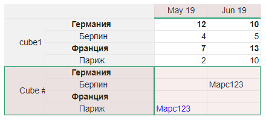

# Окружение

## Интерфейс Environment<a name="environment"></a>
```ts
interface Environment {
	load(name: string): this;
	loadFromMulticube(name: string, view?: string | null): this;
	get(key: string, def?: any): any;
	set(name: string, value: number | string | null): this;
}
```
Интерфейс для доступа к [переменным окружения](https://ru.wikipedia.org/wiki/%D0%9F%D0%B5%D1%80%D0%B5%D0%BC%D0%B5%D0%BD%D0%BD%D0%B0%D1%8F_%D1%81%D1%80%D0%B5%D0%B4%D1%8B).

&nbsp;

```js
load(name: string): Environment;
```
Загружает значения переменных окружения из нуль-мерного мультикуба `name`. Возвращает `this`.

&nbsp;

```js
loadFromMulticube(name: string, view?: string | null): Environment;
```
Загружает данные в переменную окружения `view` (или `name`, если `view` не задано) из представления `view` мультикуба `name`. Если `view` не задано, используется представление по умолчанию. Возвращает `this`.

Построение объектов переменных происходит по следующему принципу: ключом первого уровня является первый заголовок строки, ключами второго и нескольких последующих – второй, третий и последующие заголовки строки (если они есть), ключами следующих уровней являются заголовки столбцов. Ключи естественно соответствуют расположению строк и столбцов в интерфейсе Optimacros и, кроме того, располагаются в порядке их перечисления функциями [`GridDefinitionInfo.getRowDimensions()`](./views.md#grid-definition-info.get-row-dimensions) и [`GridDefinitionInfo.getColumnDimensions()`](./views.md#grid-definition-info.get-column-dimensions). Значениями являются данные в ячейках.

К примеру, из такого представления мультикуба



загрузится такая переменная окружения:

```
{
  "cube1": {
    "Германия": {
      "May 19": 12,
      "Jun 19": 10
    },
    "Берлин": {
      "May 19": 4,
      "Jun 19": 5
    },
    "Франция": {
      "May 19": 7,
      "Jun 19": 13
    },
    "Париж": {
      "May 19": 2,
      "Jun 19": 10
    }
  },
  "Cube #15": {
    "Германия": {
      "May 19": null,
      "Jun 19": null
    },
    "Берлин": {
      "May 19": null,
      "Jun 19": "Марс123"
    },
    "Франция": {
      "May 19": null,
      "Jun 19": null
    },
    "Париж": {
      "May 19": "Марс123",
      "Jun 19": null
    }
  }
}
```

&nbsp;
	
```js
get(key: string, def?: any): any;
```
Возвращает значение переменной окружения `key`. При отсутствии этой переменной и наличии аргумента `def` возвращает `def`.

&nbsp;

```js
set(name: string, value: number | string | null): Environment;
```
Устанавливает значение переменной окружения `key` в значение `value`. Возвращает `this`.


[API Reference](API.md)

[Оглавление](../README.md)