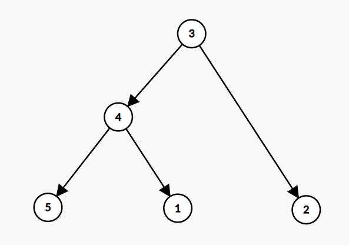

# Цепочки скриптов

## Интерфейс ResultActionsInfo<a name="result-actions-info"></a>
```ts
interface ResultActionsInfo {
	makeMacrosAction(identifier: string | number): ResultMacrosAction;
	makeCodeExecutionAction(code: string): CodeExecutionAction;
	makeDashboardOpenAction(identifier: string | number): ResultOpenAction;
	makeContextTableOpenAction(identifier: string | number): ResultOpenAction;
	makeMulticubeViewOpenAction(multicube: string | number, view?: string | number | null): ResultOpenAction;
	makeListViewOpenAction(list: string | number, view?: string | number | null): ResultOpenAction;
}
```
Интерфейс создания действий, которые можно автоматически осуществить после исполнения текущего скрипта.

&nbsp;

```js
makeMacrosAction(identifier: string | number): ResultMacrosAction;
```
Создаёт и возвращает действие [`ResultMacrosAction`](#result-macros-action) запуска существующего в модели скрипта. Аргумент `identifier` означает имя или [`longId`](./views.md#long-id) скрипта.

&nbsp;

```js
makeCodeExecutionAction(code: string): CodeExecutionAction;
```
Создаёт и возвращает действие [`CodeExecutionAction`](#code-execution-action) запуска динамического кода. Аргумент `code` - строка с кодом.

&nbsp;

```js
makeDashboardOpenAction(identifier: string | number): ResultOpenAction;
```
Создаёт и возвращает действие [`ResultOpenAction`](#result-open-action) открытия существующего в модели дашборда. Аргумент `identifier` означает имя или [`longId`](./views.md#long-id) дашборда.

&nbsp;

```js
makeContextTableOpenAction(identifier: string | number): ResultOpenAction;
```
Создаёт и возвращает действие [`ResultOpenAction`](#result-open-action) открытия существующей в модели контекстной таблицы. Аргумент `identifier` означает имя или [`longId`](./views.md#long-id) контекстной таблицы.

&nbsp;

```js
makeMulticubeViewOpenAction(multicube: string | number, view?: string | number | null): ResultOpenAction;
```
Создаёт и возвращает действие [`ResultOpenAction`](#result-open-action) открытия существующего в модели мультикуба. Аргумент `identifier` означает имя или [`longId`](./views.md#long-id) мультикуба, `view` означает имя или [`longId`](./views.md#long-id) представления.

&nbsp;

```js
makeListViewOpenAction(list: string | number, view?: string | number | null): ResultOpenAction;
```
Создаёт и возвращает действие [`ResultOpenAction`](#result-open-action) открытия существующего в модели справочника. Аргумент `identifier` означает имя или [`longId`](./views.md#long-id) справочника, `view` означает имя или [`longId`](./views.md#long-id) представления.

&nbsp;

### Интерфейс ButtonInfoOptions<a name="button-info-options"></a>
```ts
interface ButtonInfoOptions {
	setLabel(label: string): this;
	setStyle(style: string): this;
}
```
Интерфейс настроек кнопки. Все функции возвращают `this`.

&nbsp;

```js
setLabel(label: string): this;
```
Устанавливает текст кнопки.

&nbsp;

```js
setStyle(style: string): this;
```
Устанавливает стиль кнопки. Возможные значения: `'PRIMARY'` – кнопка цвета темы Optimacros, `'SECONDARY'` – скучная, неинтересная кнопка. Значение по умолчанию: `'PRIMARY'`.

&nbsp;

### Интерфейс ButtonInfo<a name="button-info"></a>
```ts
interface ButtonInfo {
	setType(type: string): this;
	options(): ButtonInfoOptions;
}
```
Интерфейс информации о кнопке.

&nbsp;

```js
setType(type: string): this;
```
Устанавливает тип кнопки. Возможные значения: `'GENERAL'` – подтверждение действия, `'CLOSE'` – отмена действия (в этом случае после завершения скрипта обе кнопки в интерфейсе Optimacros будут кнопками отмены). Значение по умолчанию: `'GENERAL'`. Возвращает `this`.

&nbsp;
	
```js
options(): ButtonInfoOptions;
```
Возвращает интерфейс [`ButtonInfoOptions`](#button-info-options) настроек кнопки.

&nbsp;

### Интерфейс EnvironmentInfo<a name="environment-info"></a>
```ts
interface EnvironmentInfo {
	set(key: string, value: any): this;
	get(key: string): any;
}
```
Интерфейс [`переменных окружения`](https://ru.wikipedia.org/wiki/%D0%9F%D0%B5%D1%80%D0%B5%D0%BC%D0%B5%D0%BD%D0%BD%D0%B0%D1%8F_%D1%81%D1%80%D0%B5%D0%B4%D1%8B). Значениями могут быть только [`сериализуемые`](https://developer.mozilla.org/ru/docs/Web/JavaScript/Reference/Global_Objects/JSON/stringify) в JSON данные.

&nbsp;

```js
set(key: string, value: any): this;
```
Устанавливает переменной `key` значение `value`. Возвращает `this`.

&nbsp;

```js
get(key: string): any;
```
Возвращает значение переменной `key`.

&nbsp;

### Интерфейс ResultBaseAction<a name="result-base-action"></a>
```ts
interface ResultBaseAction {
	appendAfter(): this;
	setModelId(modelId: string): this;
}
```
Базовый интерфейс действия.

&nbsp;

```js
appendAfter(): this;
```
Добавляет действие в реестр последующего запуска. Оно будет выполнено после исполнения текущего скрипта. При этом если действием является запуск очередного скрипта [`ResultMacrosAction`](#result-macros-action), который в свою очередь тоже может добавить в реестр действие запуска некоторого количества скриптов, то функционирование реестра запуска осуществляется в соответствии с алгоритмом обхода дерева запусков [`в глубину`](https://ru.wikipedia.org/wiki/%D0%9F%D0%BE%D0%B8%D1%81%D0%BA_%D0%B2_%D0%B3%D0%BB%D1%83%D0%B1%D0%B8%D0%BD%D1%83).

Рассмотрим пример. Скрипт `3` последовательно добавляет действия запусков скриптов `4` и `2`. Скрипт `4` последовательно добавляет действия запусков скриптов `5` и `1`:



В такой ситуации скрипты исполнятся в следующем порядке: `3 -> 4 -> 5 -> 1 -> 2`.

&nbsp;

```js
setModelId(modelId: string): this;
```
Устанавливает имя или `id` модели, к которой будет относиться выполнение действия. Этот механизм позволяет запустить скрипт или код в другой модели.

&nbsp;

### Интерфейс TaskPromiseResult<a name="task-promise-result"></a>
```ts
interface TaskPromiseResult {
	getOutput(): string;
	getDescription(): string;
	getEnvironmentInfo(): EnvironmentInfo;
}
```
Интерфейс результата разрешения промиса — задачи, запущенной с опцией [`withPromise(true)`](#base-code-execution-action) с помощью метода `run()`.

&nbsp;

```js
getOutput(): string;
```
Возвращает вывод скрипта, который тот отправил с помощью метода `console.log()`.

&nbsp;

```js
getDescription(): string;
```
Возвращает описание задачи, установленное методом [`setTaskDescription()`](#base-code-execution-action).

&nbsp;

```js
getEnvironmentInfo(): EnvironmentInfo;
```
Возвращает интерфейс [`EnvironmentInfo`](#environment-info) для чтения [`переменных окружения`](https://ru.wikipedia.org/wiki/%D0%9F%D0%B5%D1%80%D0%B5%D0%BC%D0%B5%D0%BD%D0%BD%D0%B0%D1%8F_%D1%81%D1%80%D0%B5%D0%B4%D1%8B), которые были доступны скрипту.

&nbsp;

### Интерфейс TaskPromise<a name="task-promise"></a>
```ts
interface TaskPromise {
	getStatus(): string | null;
	wait(wait: number): TaskPromiseResult | null;
}
```
Интерфейс взаимодействия с [промисом](https://developer.mozilla.org/ru/docs/Web/JavaScript/Reference/Global_Objects/Promise) для задачи. Строго говоря, данный промис не является реализацией родного промиса `javascript`, а специальным механизмом асинхронного выполнения скриптов в `OM`.

&nbsp;

```js
getStatus(): string | null;
```
Возвращает одно из значений статуса выполнения задачи: `NONE` — задача ещё не инициализирована, `WAIT_IN_QUEUE` — задача ожидает очереди на выполнение, `IN_PROGRESS` — задача выполняется прямо сейчас, `SUCCESS` — задача успешно завершена, `FAILED` — задача завершилась с ошибкой, `ABORTED` — задача была отменена. Если по каким-то причинам статус или задача не будут найдены, то метод вернёт `null`.

&nbsp;

```js
wait(wait: number): TaskPromiseResult | null;
```
Устанавливает время ожидания разрешения промиса в секундах. Если установить параметр `wait` равным `0`, то метод будет ждать завершения задачи. Возвращает [`TaskPromiseResult`](#task-promise-result), если ответ пришёл в рамках установленного времени, иначе `null`.

&nbsp;

### Интерфейс BaseCodeExecutionAction<a name="base-code-execution-action"></a>
```ts
interface BaseCodeExecutionAction extends ResultBaseAction {
	setLockMode(value: string): this;
	setAutoRunTimeout(seconds: number): this;
	buttonInfo(): ButtonInfo;
	environmentInfo(): EnvironmentInfo;
	withPromise(withPromise: boolean): this;
	setTaskDescription(description: string): this;
	run(): TaskPromise | null;
}
```
Базовый интерфейс действия запуска скрипта. Наследуется от [`ResultBaseAction`](#result-base-action).

&nbsp;

```js
setLockMode(value: string): this;
```
Устанавливает режим блокировки модели, где `value` соответствует режиму `Lock Mode` (`CUSTOM`|`SHARED`|`UNIQUE`). Значение по умолчанию `UNIQUE`. Подробнее о режимах блокировки [здесь](../advancedFeatues/modelLock.md).

&nbsp;

```js
setAutoRunTimeout(seconds: number): this;
```
Устанавливает тайм-аут запуска скрипта в секундах. Значение по умолчанию: `0`. Если задан ненулевой тайм-аут, дальнейшие действия зависят от факта вызова функции `buttonInfo()`.

Если `buttonInfo()` *не* была вызвана, после исполнения текущего скрипта произойдёт ожидание заданного тайм-аута и запустится следующий скрипт, однако результат вывода текущего скрипта на экране не отобразится.

Если `buttonInfo()` была вызвана, после исполнения текущего скрипта на экране отобразится его вывод и кнопки, указанные в описании этой функции. При этом на кнопке [`ButtonInfo`](#button-info) будет располагаться таймер обратного отсчёта заданного тайм-аута. Если пользователь не произведёт за это время действий, автоматически будет нажата эта кнопка.

Возвращает `this`.

&nbsp;

<a name="result-macros-action.button-info"></a>
```js
buttonInfo(): ButtonInfo;
```
В случае вызова этой функции после завершения работы скрипта в интерфейсе Optimacros появятся 2 кнопки: `Отмена`, которая отменяет запуск действия, и кнопка, чьи вид и поведение определяются интерфейсом [`ButtonInfo`](#button-info), который и возвращает функция. Данный функционал работает только при запуске через `appendAfter()`.

&nbsp;

```js
environmentInfo(): EnvironmentInfo;
```
Возвращает интерфейс [`EnvironmentInfo`](#environment-info) для передачи [`переменных окружения`](https://ru.wikipedia.org/wiki/%D0%9F%D0%B5%D1%80%D0%B5%D0%BC%D0%B5%D0%BD%D0%BD%D0%B0%D1%8F_%D1%81%D1%80%D0%B5%D0%B4%D1%8B) скрипту.

&nbsp;

```js
withPromise(withPromise: boolean): this;
```
Устанавливает опцию для запуска скрипта с [промисом](https://developer.mozilla.org/ru/docs/Web/JavaScript/Reference/Global_Objects/Promise). По умолчанию `false`.

&nbsp;

```js
setTaskDescription(description: string): this;
```
Устанавливает описание для задачи.

&nbsp;

```js
run(): TaskPromise | null;
```
Запускает скрипт с помощью асинхронного механизма выполнения. Вызов метода породит задачу, которая не будет дожидаться завершения текущей задачи, а будет выполняться сразу. Так как родительская задача не завершается и может работать параллельно с дочерней, то важно следить за совместимостью режимов блокировок родительской и дочерней задач (иначе можно попасть в `dead lock`). На данный момент существует защита от погружения в бесконечную рекурсию и задача, запущенная через `run()`, не может сама использовать этот метод. Если до запуска скрипта был вызван метод `withPromise(true)`, возвращает [`TaskPromise`](#task-promise), иначе — `null`.

&nbsp;

## Интерфейс ResultMacrosAction<a name="result-macros-action"></a>
```ts
interface ResultMacrosAction extends BaseCodeExecutionAction {

}
```
Интерфейс действия запуска скрипта, сохраненного в модели в списке скриптов модели. Наследуется от [`BaseCodeExecutionAction`](#base-code-execution-action).

&nbsp;

## Интерфейс CodeExecutionAction<a name="code-execution-action"></a>
```ts
interface CodeExecutionAction extends BaseCodeExecutionAction {
	setMemoryLimit(value: number): this;
	setTimeLimit(value: number): this;
}
```
Интерфейс действия запуска динамического кода. Наследуется от [`BaseCodeExecutionAction`](#base-code-execution-action).

&nbsp;

```js
setMemoryLimit(value: number): this;
```
Устанавливает ограничение памяти. Работает аналогично ограничению памяти, выставляемому каждому скрипту в списке скриптов модели на вкладке `Макросы` -> `Скрипты`.

&nbsp;

```js
setTimeLimit(value: number): this;
```
Устанавливает ограничение времени. Работает аналогично ограничению времени выполнения, выставляемому каждому скрипту в списке скриптов модели на вкладке `Макросы` -> `Скрипты`.

&nbsp;

### Интерфейс ResultOpenAction<a name="result-open-action"></a>
```ts
interface ResultOpenAction extends ResultBaseAction {
	buttonInfo(): ButtonInfo;
}
```
Интерфейс действия открытия некоторого объекта `Optimacros`. Наследуется от [`ResultBaseAction`](#result-base-action).

&nbsp;

```js
buttonInfo(): ButtonInfo;
```
Работает так же, как и [`ResultMacrosAction`](#result-macros-action).[`buttonInfo()`](#result-macros-action.button-info).

&nbsp;

[API Reference](API.md)

[Оглавление](../README.md)
