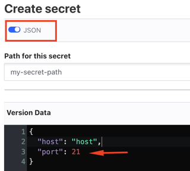

# Секреты

Для хранения чувствительных данных (логины, пароли, хеши) пользователи могут воспользоваться сервисом [OpenBao](https://openbao.org/), который поставляется с дистрибутивом. У сервиса есть UI: `workspace_url/openbao/ui`. Через него клиенты записывают в защищенное хранилище важные данные, чтобы затем использовать в скриптах.

Такие данные называются **секретами**. Они бывают разных видов. Поддерживаемые типы: 
- `OpenBaoKeyValueSecret` - ключ-значение

&nbsp;

**Важно!** Запись в хранилище данных в формате, отличном от строкового (например порт подключения является числом), необходимо выполнять в режиме JSON, иначе они будут трактоваться как строка.



&nbsp;

## Интерфейс Secrets<a name="secrets"></a>
```ts
interface Secrets {
	getStorage(vaultId: string): SecretStorage;
}
```
Интерфейс для доступа к секретам.

&nbsp;

```js
getStorage(vaultId: string): SecretStorage;
```
Возвращает хранилище [`SecretStorage`](#secret-storage) с идентификатором `vaultId`.

К воркспейсу могут быть подключены сразу несколько хранилищ. Доступ настраивается в манифесте воркспейса администратором. Поддерживаются решения [OpenBao](https://openbao.org/) и [Hashicorp Vault](https://www.vaultproject.io/). Список подключенных хранилищ и их идентификаторы `id` можно посмотреть в панели администратора воркспейса в разделе `Secrets`. В одном скрипте можно обращаться к любому из них или сразу к нескольким.

&nbsp;

## Интерфейс SecretStorage<a name="secret-storage"></a>
```ts
interface SecretStorage {
	getSecret(path: string, key: string): SecretValue;
}
```
Интерфейс для работы с защищенным хранилищем секретов.

&nbsp;

```js
getSecret(path: string, key: string): SecretValue;
```
Возвращает секрет [`SecretValue`](#secret-value).

Секреты в хранилищах хранятся в иерархиях.
```
/secret/path-to-secrets
|--- secret-key-1
|--- secret-key-2
```

Получить секрет можно, зная "папку" `path`, в которой он лежит, и название ключа секрета `key`.

&nbsp;

## Интерфейс SecretValue<a name="secret-value"></a>
```ts
interface SecretValue {
	getStorageIdentifier(): string;
	getPath(): string;
	getKey(): string;
	toJson(): Object;
}
```
Объект секрета. **Обратите внимание, что значения секрета в объекте нет.** Он только содержит информацию о секрете. Так сделано для безопасности. Значения считываются из хранилища только внутри приложения Optimacros. Этот объект нужно передавать в методы API скриптов, которые поддерживают секреты, вместо простых типов данных. Приложение само сделает запрос в хранилище и подставит значение секрета.

Опознать методы с поддержкой секретов можно по сигнатуре `setPassword(password: string | SecretValue): this;`. Появляется выбор - использовать простой тип данных или секрет. Проверка типа значения также работает на секретах. Если тип не совпадет с тем, который ожидается методом, вылетит ошибка.

&nbsp;

```js
getStorageIdentifier(): string;
```
Возвращает идентификатор хранилища.

&nbsp;

```js
getPath(): string;
```
Возвращает название папки, в которой находится секрет.

&nbsp;

```js
getKey(): string;
```
Возвращает название ключа секрета.

&nbsp;

```js
toJson(): Object;
```
Возвращает JSON-объект секрета вида
```ts
{
    "secret": true,
    "params": {
        "key": "secret-key",
        "path": "secret-path",
        "storageIdentifier": "vault-id",
    },
}
```
Такой JSON-объект также можно передавать в методы с поддержкой секретов. Наличие ключа `secret` определяет объект как секрет вне зависимости от его значения. В текущей реализации для этого ключа необходимо всегда указывать значение `true`, иначе будет выбрасываться ошибка валидации объекта как секрета при передаче его в метод.

&nbsp;

## Примеры

Получение секрета из хранилища и передача его в метод API скриптов
```ts
const secret = om.secrets.getStorage('openbao-vault').getSecret('ftp-connection', 'host');

const ftp = om.filesystems.ftp();

ftp.setHost(secret);
```

&nbsp;

Самостоятельное создание JSON-объекта секрета и передача его в метод API скриптов
```ts
const secret = {
    "secret": true,
    "params": {
        "key": "host",
        "path": "ftp-connection",
        "storageIdentifier": "openbao-vault",
    },
};

const ftp = om.filesystems.ftp();

ftp.setHost(secret);
```

&nbsp;

Передача секрета в дочерний скрипт в составе JSON-oбъекта
```ts
const secret = om.secrets.getStorage('openbao-vault').getSecret('secret-path', 'secret-key');

const ENV = {
    SECRET: secret.toJson(),
};

om.common.resultInfo()
    .actionsInfo()
    .makeMacrosAction('next script')
    .appendAfter()
    .environmentInfo()
    .set('ENV', ENV);
```

&nbsp;

[API Reference](./API.md)

[Оглавление](../README.md)