#  Документация по скриптам 1.0 [Optimacros](https://optimacros.ru/)

Скрипты 1.0 – сущность модели Optimacros.

Основные задачи скриптов: интеграция данных между Optimacros и внешними системами и автомагическая модификация данных модели.


## Требования к разработчику скриптов

* Прохождение [курса](https://www.youtube.com/playlist?list=PLAQWOaLtueJeH8Ldr-lrFNhWJYmmX7K6s) обучения моделлера.

* Владение базовыми навыками JS (обучиться можно здесь: https://learn.javascript.ru/): 
  * Циклы
  * Функции, стрелочные функции
  * Объекты
  * Регулярные выражения
  * Дата и время

* Общая адекватность.

&nbsp;

# Расширенные возможности


## Лимиты времени и памяти

В разделе `Макросы` -> `Скрипты` интерфейса Optimacros есть поля `Memory Limit, MB` и `Time Limit, sec`:

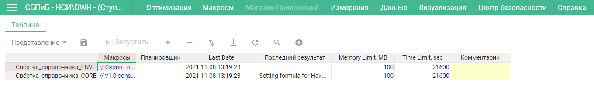

Они указывают соответственно лимит потребляемой памяти и лимит времени выполнения скрипта.

Администратор воркспейса может изменять эти лимиты. Он может записать в соответствующие ячейки любые значения, однако при запуске скрипта они будут ограничены допустимыми диапазонами, при том что значения в таблице скриптов останутся неизменными.

| Лимит        | Единица измерения | Значение по умолчанию | Минимум |            Максимум |
| -------------|:-----------------:|:---------------------:|:-------:|:-------------------:|
| Время        | Секунда           |   `21600` (`6 часов`) |     `1` | `86400` (`24 часа`) |
| Память       | Мегабайт          |                 `100` |     `1` |  `2048` (`2 Гбайт`) |


## Блокировка модели

Optimacros предусматривает три уровня блокировки модели: `shared lock`, `unique lock` и `complete lock`.

`Shared lock` – режим, не предполагающий изменение метаданных модели. В этом режиме можно читать данные модели и модифицировать данные мультикубов. Нет ограничения на количество пользователей.

`Unique lock` – режим, который включается непосредствнно перед модификацией метаданных (например, добалением элемента в справочник). Одновременно в 
том режиме может существовать только один скрипт, при этом пользователи `shared lock` могут продолжать свою работу, поскольку модификация метаданных в Optimacros построена на транзакционном подходе. Непосредственно перед завершением (commit) транзакции уровень блокировки меняется на `complete lock`.

`Complete lock` – режим, при котором блокируются все пользователи.

Каждый скрипт при старте находится в режиме `shared lock`. При модификации метаданных он переходит в режим `unique lock` и находится в нём либо до завершения (commit), либо до отката (rollback) транзакции. Перед завершением транзакции скрипт переходит в режим `complete lock`, а после завершения – в `shared lock`. В случае отката транзакции скрипт сразу возвращается в режим `shared lock`.

Такое устройство системы блокировок означает, что модели Optimacros позволяют эффективно многократно модифицировать данные мультикубов, не блокируя других пользователей. (Тем не менее, для ускорения множества таких операций рекомендуется группировать их, например, с помощью [`CellBuffer`](../API/common.md#CellBuffer), импорта из [`файла CSV`](../API/exportImport.md#import) или из [`базы данных`](../API/relationalDB.md#DBimport)). Однако при многократной модификации метаданных, другие пользователи модели будут также многократно блокироваться. Поэтому особенно важно при проектировании скриптов предусмотреть группировку операций, в частности [добавления](../API/elementsManipulator.md#ElementsCreator), [удаления](../API/elementsManipulator.md#ElementsDeleter) или [тасования](../API/elementsManipulator.md#ElementsReorder) элементов в справочниках.


# Курс молодого бойца / Cook book


Эти уроки ещё не готовы:

1. [Разбор скрипта Частичное копирование справочников](partialListCopy.md) <== ГОТОВ ==>
1. [Разбор скрипта Свёртка справочника](listReduce.md) <== ГОТОВ ==>

## Доступ к измерениям в строках, столбцах и фильтрах

Для выполнения этого задания понадобится тестовая модель и тестовый мультикуб, который нужно создать, если ваша модель пуста.

В этом упражнении в качестве примера будет использоваться модель `FinMod_Parking (Exp)`, работа будет вестись с мультикубом `Условия и расчёты`:

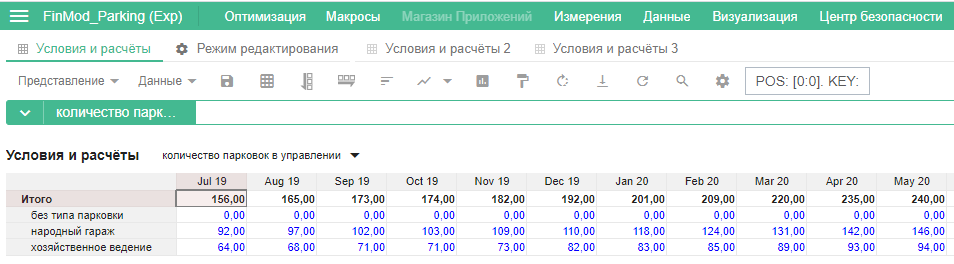

### Доступ к измерениям в строках

Сначала скрипту необходимо открыть мультикуб. Скрипт начинает свой путь с переменной [om](../API/API.md#OM), обращаясь к свойствам для углубления в модель. Для того, чтобы с помощью скрипта найти раздел `Данные` -> `Мультикубы`, мы используем интерфейс [Multicubes](../API/views.md#Multicubes). Для перехода в этот раздел необходимо вызвать функцию `multicubesTab()`. Сохраним результат в константу `multicubesTab`:

```js
const multicubesTab = om.multicubes.multicubesTab();
```

Таким образом, с помощью скрипта мы добрались до списка мультикубов модели. Теперь для того, чтобы выбрать интересующий нас мультикуб, необходимо вызвать функцию `open()` из интерфейса [MulticubesTab](../API/views.md#MulticubesTab) и в качестве аргумента указать имя мультикуба, с которым мы хотим работать. Сохраним открытый мультикуб в константу `multicubeTab`. Теперь код выглядит так:

```js
const multicubesTab = om.multicubes.multicubesTab();
const multicubeTab = multicubesTab.open('Условия и расчёты');
```

После того, как макрос открыл мультикуб, ему нужно понять, как именно расположить измерения, либо выбрать представление, в котором уже сохранено расположение измерений. Однако в скриптах 1.0 есть только [один способ](../appendix/constraints.md#pivot) получить доступ к представлению мультикуба.

Вызовем функцию `pivot()` из интерфейса [Tab](../API/views.md#Tab). Мы будем просматривать представление `Условия и расчёты 3`. Сохраним открытое представление в константу `pivot`:

```js
const pivot = multicubeTab.pivot('Условия и расчёты 3');
```
После того, как мы выбрали представление, следует обратиться к таблице с данными. Для этого используем функцию `create()` интерфейса [Pivot](../API/views.md#Pivot). Ссылку на таблицу сохраним в константу `grid`:

```js
const pivot = multicubeTab.pivot('Условия и расчёты 3');
const grid =  pivot.create();
```

Проверим работоспособность скрипта. Для этого выведем количество строк с помощью функции `rowCount()` интерфейса [Grid](../API/views.md#Grid):

```js
const multicubesTab = om.multicubes.multicubesTab();
const multicubeTab = multicubesTab.open('Условия и расчёты');

const pivot = multicubeTab.pivot('Условия и расчёты 3');
const grid =  pivot.create();

console.log(`Rows: ${grid.rowCount()} \n`);
```

Здесь стоит обратить внимание, что функция `console.log()` [не переносит курсор](../appendix/constraints.md#noLineBreak) на следующую строку, и это необходимо делать вручную.

Запустим скрипт для проверки работоспособности:

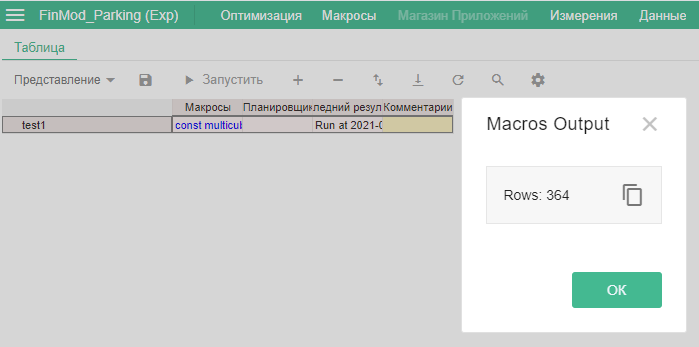

Теперь попробуем получить названия измерений, которые указаны в строках. Для начала сохраним информацию об измерениях в константу `definitionInfo` с помощью функции `getDefinitionInfo()`, вызванной на `grid`. И создадим константу `rowDimensionNames`, которую впоследствии заполним наименованиями измерений:

```js
const definitionInfo =  grid.getDefinitionInfo();
let rowDimensionNames = [];
```

Для того, чтобы просмотреть измерения, используемые в строках таблицы, нам нужно вызвать функцию `getRowDimensions()` интерфейса [GridDefinitionInfo](../API/views.md#GridDefinitionInfo). Эта функция обратится к измерениям на строках и вернёт их в виде массива (для нашей тестовой таблицы массив будет содержать два элемента: `Кубы`, `s.Тип парковки`):

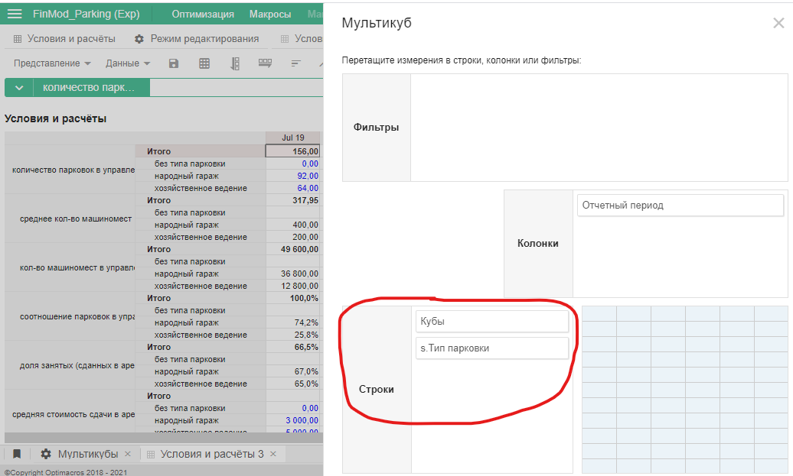

Для перебора массива воспользуемся [forEach()](https://developer.mozilla.org/ru/docs/Web/JavaScript/Reference/Global_Objects/Array/forEach) с параметром `gridDimension`, в котором присвоим переменной `entity` результат работы функции.

Для того, чтобы в `entity` получить сущность [EntityInfo](../API/views.md#EntityInfo) измерения, вызовем функцию `getDimensionEntity()` интерфейса [GridDimension](../API/views.md#GridDimension). После чего добавим все названия измерений с помощью [push()](https://developer.mozilla.org/ru/docs/Web/JavaScript/Reference/Global_Objects/Array/push) в созданный нами ранее массив `rowDimensionNames`. Осталось лишь написать вывод информации о количестве измерений:

```js
const multicubesTab = om.multicubes.multicubesTab();
const multicubeTab = multicubesTab.open('Условия и расчёты');

const pivot = multicubeTab.pivot('Условия и расчёты 3');
const grid =  pivot.create();

console.log(`Rows: ${grid.rowCount()} \n`);
console.log(`Columns: ${grid.columnCount()} \n`);

const definitionInfo = grid.getDefinitionInfo();
let rowDimensionNames = [];
definitionInfo.getRowDimensions().forEach(gridDimension => {
    const entity = gridDimension.getDimensionEntity();
    rowDimensionNames.push(entity.name());
});

console.log(`Row dimensions: ${rowDimensionNames.join(', ')} \n`);
```
Запускаем скрипт:

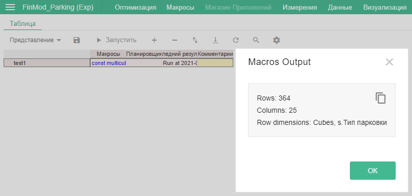

### Доступ к измерениям в столбцах

Для того, чтобы получить названия измерений в столбцах, используется аналогичная механика. Оставим уже написаный выше скрипт и допишем пару строк.

Чтобы получить измерения в столбцах, воспользуемся функцией `getColumnDimensions()` интерфейса [GridDefinitionInfo](../API/views.md#GridDefinitionInfo):

```js
let columnDimensionNames = [];
definitionInfo.getColumnDimensions().forEach(gridDimension => {
    const entity = gridDimension.getDimensionEntity();
    columnDimensionNames.push(entity.name());
});
```

Добавим вывод `columnDimensionNames`, и тогда скрипт примет следующий вид:

```js
const multicubesTab = om.multicubes.multicubesTab();
const multicubeTab = multicubesTab.open('Условия и расчёты');

const pivot = multicubeTab.pivot('Условия и расчёты 3');
const grid =  pivot.create();

console.log(`Rows: ${grid.rowCount()} \n`);
console.log(`Columns: ${grid.columnCount()} \n`);

const definitionInfo =  grid.getDefinitionInfo();
let rowDimensionNames = [];
definitionInfo.getRowDimensions().forEach(gridDimension => {
    const entity = gridDimension.getDimensionEntity();
    rowDimensionNames.push(entity.name());
});

console.log(`Row dimensions: ${rowDimensionNames.join(', ')} \n`);

let columnDimensionNames = [];
definitionInfo.getColumnDimensions().forEach(gridDimension => {
    const entity = gridDimension.getDimensionEntity();
    columnDimensionNames.push(entity.name());
});

console.log(`Column dimensions: ${columnDimensionNames.join(', ')} \n`);
```

Результат работы скрипта:

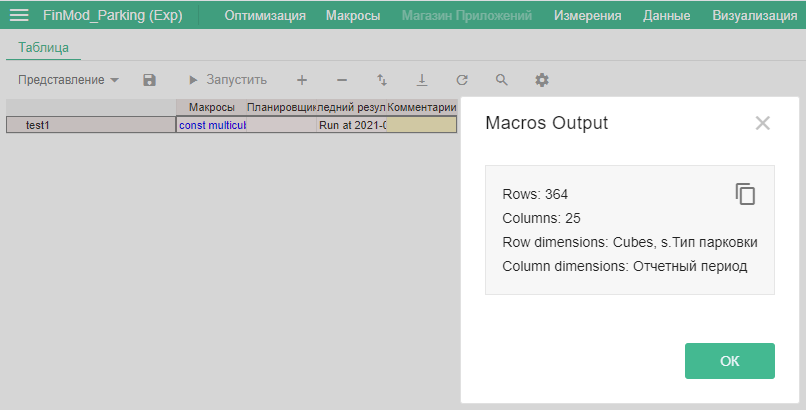

### Доступ к измерениям в фильтрах

Чтобы получить доступ к измерениям в фильтрах, необходимо использовать немного усложнённую механику. Создаём массив `pageSelectedNames`. Для получения интерфейса с данными об измерениях в фильтрах представления вызываем функцию `getPageSelectors()` интерфейса [GridDefinitionInfo](../API/views.md#GridDefinitionInfo):

```js
let pageSelectedNames = [];
definitionInfo.getPageSelectors().forEach(pageSelector => {
    const dimensionEntity = pageSelector.getDimensionEntity();
});
```
А теперь отличие от двух предыдущих пунктов. Помимо наименований измерений в фильтрах, необходимо также получить информацию о выбранном элементе в фильтре. Для этого используется функция `getSelectedEntity()` (интерфейс [GridPageSelector](../API/views.md#GridPageSelector)):

```js
let pageSelectedNames = [];
definitionInfo.getPageSelectors().forEach(pageSelector => {
    const dimensionEntity = pageSelector.getDimensionEntity();
    const selectedEntity = pageSelector.getSelectedEntity();
});
```

Далее мы будем добавлять информацию по каждому измерению и выбранному элементу в этом измерении в массив `pageSelectedNames`:

```js
const pageSelectedNames = [];
definitionInfo.getPageSelectors().forEach(pageSelector => {
    const dimensionEntity = pageSelector.getDimensionEntity();
    const selectedEntity = pageSelector.getSelectedEntity();
    pageSelectedNames.push(`${dimensionEntity.name()} (${selectedEntity.name()})`);
});
```

Добавим строку с выводом `pageSelectedNames`, и в итоге скрипт будет выглядеть так:

```js
const multicubesTab = om.multicubes.multicubesTab();
const multicubeTab = multicubesTab.open('Условия и расчёты');

const pivot = multicubeTab.pivot('Условия и расчёты 3');
const grid = pivot.create();

console.log(`Rows: ${grid.rowCount()} \n`);
console.log(`Columns: ${grid.columnCount()} \n`);

const definitionInfo =  grid.getDefinitionInfo();
const rowDimensionNames = [];
definitionInfo.getRowDimensions().forEach(gridDimension => {
    const entity = gridDimension.getDimensionEntity();
    rowDimensionNames.push(entity.name());
});

console.log(`Row dimensions: ${rowDimensionNames.join(', ')} \n`);

const columnDimensionNames = [];
definitionInfo.getColumnDimensions().forEach(gridDimension => {
    const entity = gridDimension.getDimensionEntity();
    columnDimensionNames.push(entity.name());
});

console.log(`Column dimensions: ${columnDimensionNames.join(', ')} \n`);

const pageSelectedNames = [];
definitionInfo.getPageSelectors().forEach(pageSelector => {
    const dimensionEntity = pageSelector.getDimensionEntity();
    const selectedEntity = pageSelector.getSelectedEntity();
    pageSelectedNames.push(`${dimensionEntity.name()} (${selectedEntity.name()})`);
});

console.log(`Filter dimensions: ${pageSelectedNames.join(', ')} \n`);
```

Результат работы скрипта:

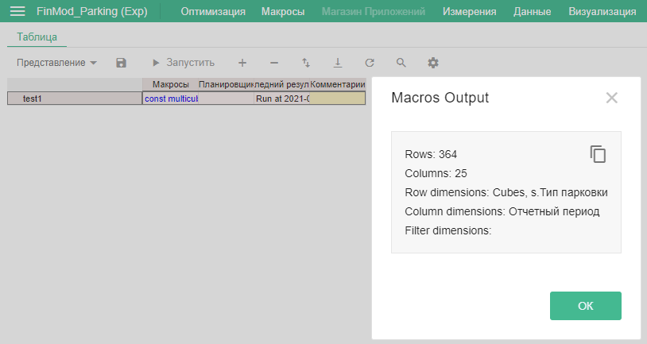

Вроде всё сделали верно, но почему после `Filter dimensions:` пустота? Потому что в фильтрах на этом представлении нет измерений, следовательно, скрипт выводит пустой массив:

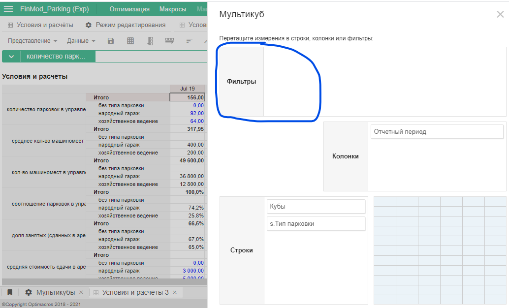

Теперь запустим скрипт на представлении, в котором есть измерения в фильтрах. В качестве тестового измерения использовалось представление `Условия и расчёты 2`:

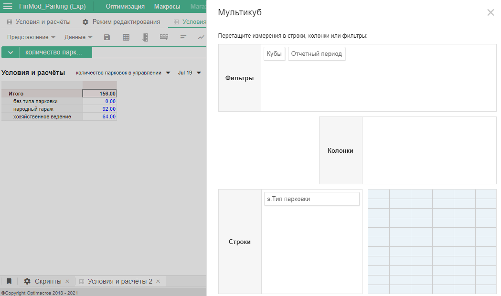

В результате данные в `Filter dimensions` появились:

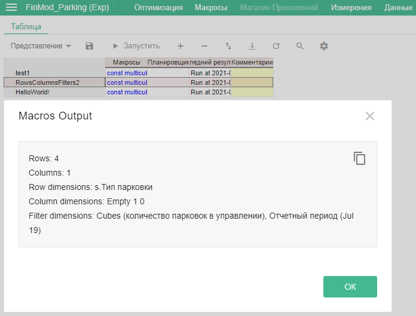

Заметим, что на столбцах появилось измерение `'Empty 1 0'`, хотя на представлении измерений на столбцах нет. Подробнее про это можно прочитать [здесь](../appendix/constraints.md#flatTable).


## Способы доступа к ячейкам

### Доступ к заголовкам строк

Для получения наименований заголовков строк необходимо обратиться к таблице представления мультикуба и последовательно перебрать каждое наименование строки таблицы.

По аналогии с предыдущим уроком для получения доступа к ячейкам представления мультикуба необходимо открыть раздел мультикубов, выбрать один из доступных, указать необходимое представление и обратиться к таблице с данными:

```js
const multicubesTab = om.multicubes.multicubesTab();
const multicubeTab = multicubesTab.open('Условия и расчёты');

const pivot = multicubeTab.pivot('Условия и расчёты 3');
const grid = pivot.create();

const range = grid.range();
const generator = range.generator();
```

Для получения данных из таблицы представления мультикуба используется функция `range()` интерфейса [Grid](../API/views.md#Grid). Она выбирает прямоугольник представления мультикуба, и если не передавать в неё аргументы, то будет захватывать всю таблицу.

На данном этапе ещё нет запроса доступа данных к указанному диапазону, и переменная `range` не содержит в себе значений клеток. Чтобы их получить, необходимо вызвать функцию-генератор – `generator()` – интерфейса [GridRange](../API/views.md#GridRange). Т. к. среда Оptimacros расчитана на работу с объектами, содержащими большие объёмы данных, запрос на получение этих данных реализован покусочно. Функция-генератор возвращает куски [GridRangeChunk](../API/views.md#GridRangeChunk) представления таблицы, с которыми можно работать в цикле.

В зависимости от представления (количества измерений в строках) логика получения данных заголовков строк будет разной. Разберём два случая. Первый, когда в измерениях строк одно измерение, и второй, когда измерений несколько.

#### Одно измерение в строках

Настройки сводной таблицы отображения мультикуба:

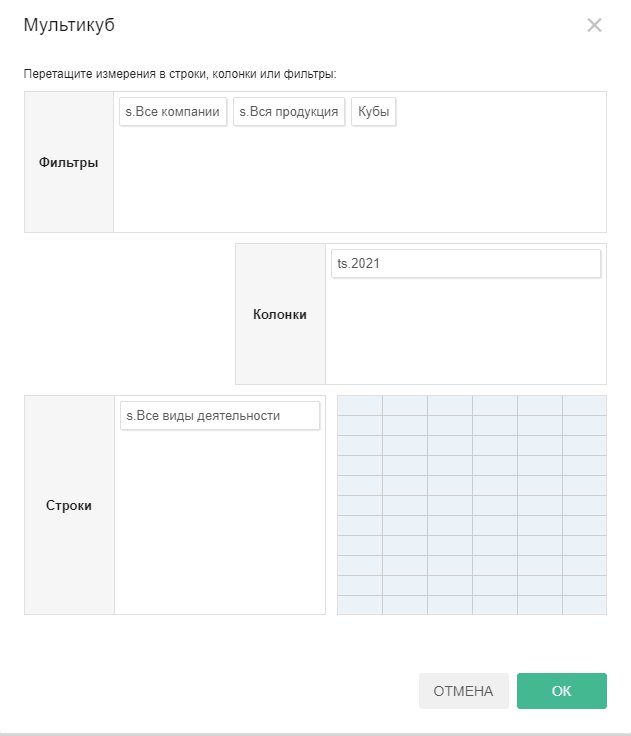

Представление таблицы мультикуба:

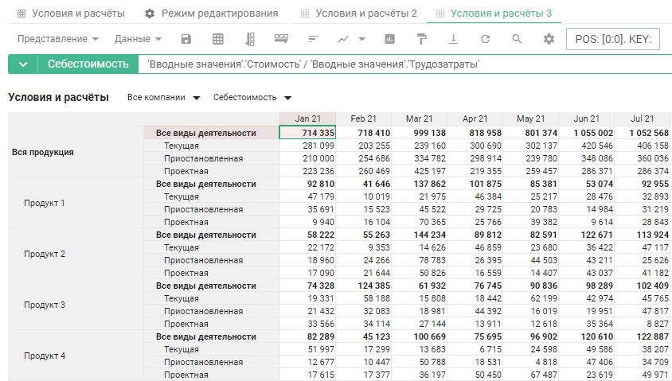

Функция `rows()`, вызванная на куске [`chunk`](../API/views.md#GridRangeChunk) диапазона, который мы указали в переменной `range`, позволяет получить доступ к заголовкам строк. Для получения полного массива заголовков строк в представлении вызываем функцию `all()` интерфейса [Labels](../API/views.md#Labels) и перебираем элементы полученного массива данных с помощью [`forEach()`](https://developer.mozilla.org/ru/docs/Web/JavaScript/Reference/Global_Objects/Array/forEach).

При переборе элементов задаём аргумент `labelsGroup` функции `forEach`, вызываем функцию `first()` интерфейса [LabelsGroup](../API/views.md#LabelsGroup), которая возвращает заголовки строк из полученного массива заголовков представления, и функцию `label()` интерфейса [EntityInfo](../API/views.md#EntityInfo), она вернёт наименования заголовков:

```js
for (const chunk of generator) {
    chunk.rows().all().forEach(labelsGroup => {
        console.log(labelsGroup.first().label());
    });
}
```

Если теперь вывести данные в консоль, то увидим склеенные в одну строку заголовки. Дело в том, что движок скриптов 1.0 [не переносит курсор](../appendix/constraints.md#noLineBreak) на следующую строку после работы функции `console.log()`:


Для удобства отображения добавим его самостоятельно:

```js
for (const chunk of generator) {
    chunk.rows().all().forEach(labelsGroup => {
        console.log(`Row label: ${labelsGroup.first().label()} \n`);
    });
}
```

Итоговый код:

```js
const multicubesTab = om.multicubes.multicubesTab();
const multicubeTab = multicubesTab.open('Условия и расчёты');

const pivot = multicubeTab.pivot('Условия и расчёты 3');
const grid =  pivot.create();

const range = grid.range();
const generator = range.generator();

for (const chunk of generator) {
    chunk.rows().all().forEach(labelsGroup => {
        console.log(`Row label: ${labelsGroup.first().label()} \n`);
    });
}
```

Как результат получаем полный список заголовков строк: 

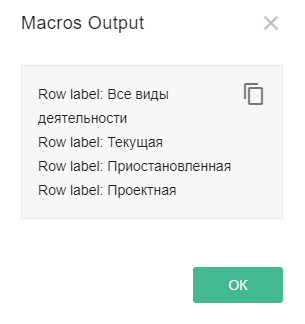

#### Несколько измерений в строках

Настройки сводной таблицы отображения мультикуба:

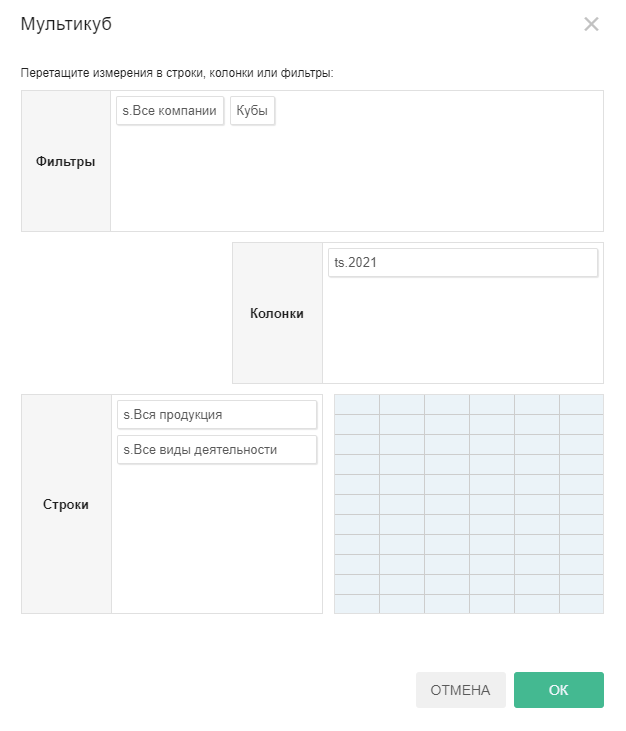

Представление таблицы мультикуба:

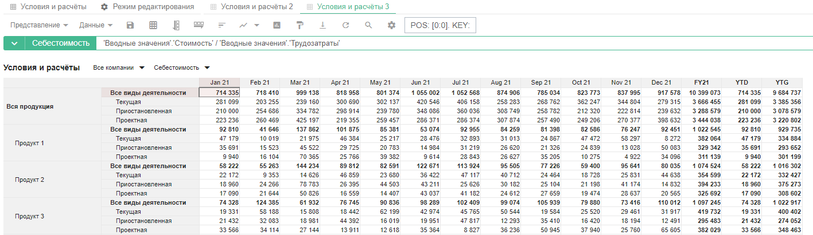

Заменим функцию `first()` на функцию `all()` (это приведёт к получению массива данных заголовков всех уровней). Чтобы получить данные вида `Заголовок 1 уровня, Заголовок 2 уровня, ...`, нужно перебирать элементы массива заголовков каждого уровня (в данном случае до второго) с помощью функции массивов [`forEach()`](https://developer.mozilla.org/ru/docs/Web/JavaScript/Reference/Global_Objects/Array/forEach).

Создадим массив `rowLabels` для хранения наименований заголовков и будем добавлять в него полученные значения. Далее значение массива выводим в консоль, указывая резделитель заголовков `', '` с помощью функции объединения массивов [`join()`](https://developer.mozilla.org/ru/docs/Web/JavaScript/Reference/Global_Objects/Array/join):

```js
for (const chunk of generator) {
    chunk.rows().all().forEach(labelsGroup => {
        const rowLabels = [];
        labelsGroup.all().forEach(label => {
            rowLabels.push(label.label());
        });
		
        console.log(`Row label: ${rowLabels.join(', ')} \n`);
    });
}
```

Итоговый код:

```js
const multicubesTab = om.multicubes.multicubesTab();
const multicubeTab = multicubesTab.open('Условия и расчёты');

const pivot = multicubeTab.pivot('Условия и расчёты 3');
const grid =  pivot.create();

const range = grid.range();
const generator = range.generator();

for (const chunk of generator) {
    chunk.rows().all().forEach(labelsGroup => {
        const rowLabels = [];
        labelsGroup.all().forEach(labels => {
            rowLabels.push(labels.label());
        });
				
        console.log(`Row label: ${rowLabels.join(', ')} \n`);
    });
}
```

В результате работы скрипта получим полный список двух уровней заголовков представления мультикуба:

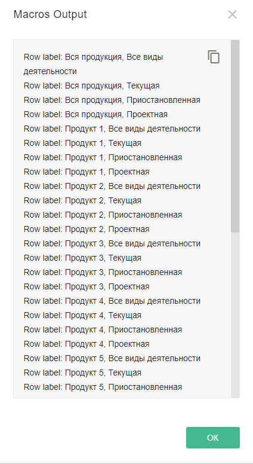

### Доступ к значениям клеток

Чтобы получить значения, которые находятся в клетках таблицы представления мультикуба, как и со строками, для начала необходимо обратиться к таблице представления и последовательно вывести данные ячеек.

#### Доступ ко всем значениям

Для получения доступа к значениям клеток используется интерфейс [Cell](../API/views.md#Cell). Функции интерфейса позволяют считывать и изменять значения клеток. Для получения значений хранящихся в ячейках вызывается функция `getValue()`. В массив `cellValues` будем сохранять полученные функцией `getValue()` значения. Итоговый код:

```js
const multicubesTab = om.multicubes.multicubesTab();
const multicubeTab = multicubesTab.open('Условия и расчёты');

const pivot = multicubeTab.pivot('Условия и расчёты 3');
const grid =  pivot.create();

const range = grid.range();
const generator = range.generator();

for (const chunk of generator) {
    chunk.rows().all().forEach(labelsGroup => {
        const rowLabels = [];
        labelsGroup.all().forEach(labels => {
            rowLabels.push(labels.label());
        });
        console.log(`Row label: ${rowLabels.join(', ')} \n`);
				
        const cellValues = [];
        labelsGroup.cells().all().forEach(cell => {
            cellValues.push(cell.getValue());
        });
        console.log(`Cells value: ${cellValues.join(', ')} \n \n`);
    });
}
```

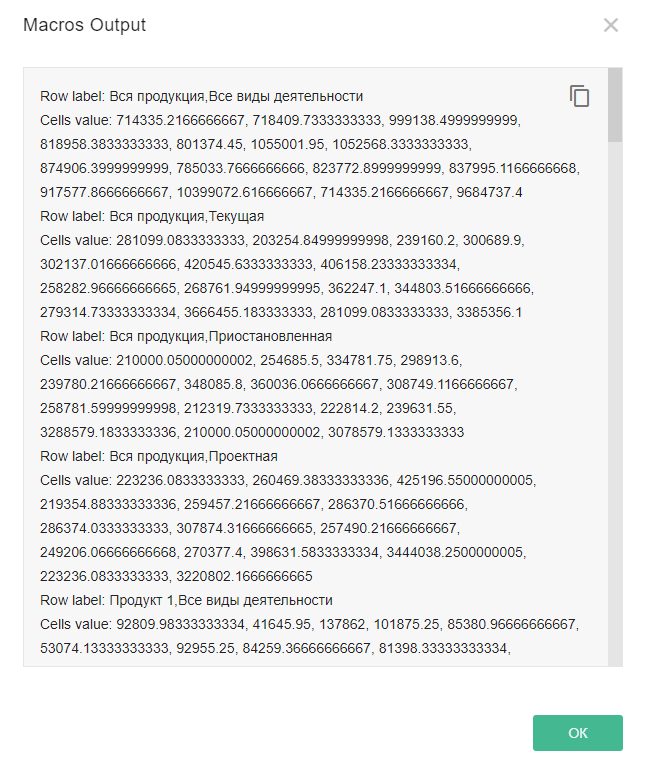

#### Доступ к значениям определённого столбца с помощью фильтра

Если нас интересуют значения только в одном столбце и не планируется считывать данные из других, то одним из вариантов написания кода будет вызов функции `columnsFilter()` интерфейса [Pivot](../API/views.md#Pivot). Создадим переменную `monthFilter`, зададим ей значение из необходимого столбца, например, `'Jan 21'`, и передадим её в функцию:

```js
const pivot = multicubeTab.pivot('Условия и расчёты 3');
const monthFilter = 'Jan 21';
const grid =  pivot.columnsFilter(monthFilter).create();

const range = grid.range();
const generator = range.generator();

console.log(`Filter on columns: ${monthFilter} \n`);
```

Т. к. в результате работы скрипта будут получены значения только одного столбца, массив `cellValues` можно не использовать.

Итоговый код:

```js
const multicubesTab = om.multicubes.multicubesTab();
const multicubeTab = multicubesTab.open('Условия и расчёты');

const pivot = multicubeTab.pivot('Условия и расчёты 3');
const monthFilter = 'Jan 21';
const grid =  pivot.columnsFilter(monthFilter).create();

const range = grid.range();
const generator = range.generator();

console.log(`Filter on columns: ${monthFilter} \n`);

for (const chunk of generator) {
    chunk.rows().all().forEach(labelsGroup => {
        const rowLabels = [];
        labelsGroup.all().forEach(labels => {
            rowLabels.push(labels.label());
        });
				
        console.log(`Row label: ${rowLabels.join(', ')} \n`);
        labelsGroup.cells().all().forEach(cell => {
            console.log(`Cells value: ${cell.getValue()} \n`);
        });
    });
}
```

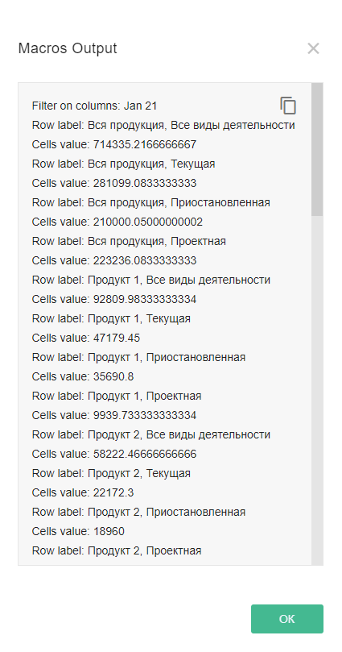


