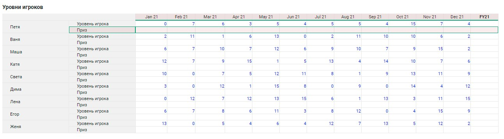
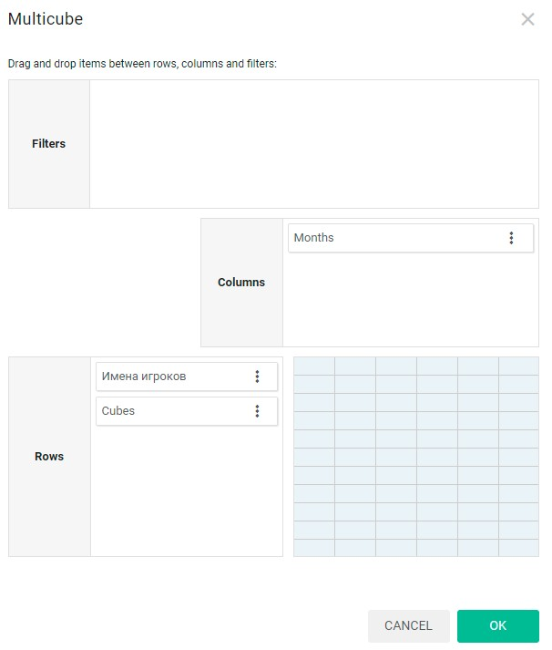
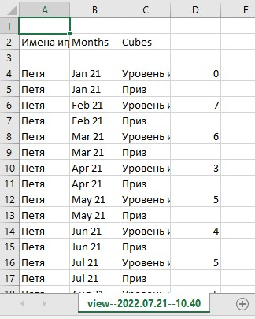
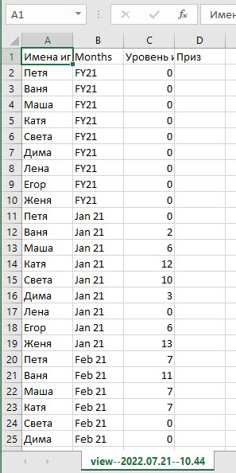
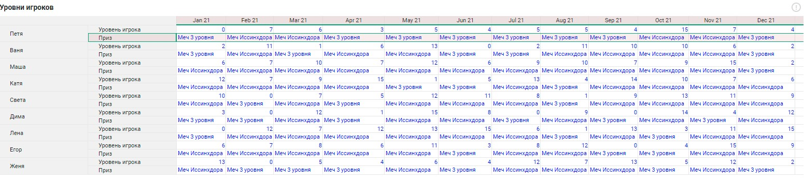

# CSV

## Экспорт и импорт из мультикуба в csv

Обычный метод модификации данных мультикуба использует функцию `generator()` интерфейса `GridRange`. Используется интерфейс `GridRangeChunk`, который построчно читает таблицу мультикуба. Нужно модифицировать необходимые строки, записать изменения в буфер и передать значения на сервер. Основной недостаток этого метода - очень медленная работа при большом размере мультикуба. Как показала практика, гораздо быстрее с этой задачей справляется метод, использующий модифицирование данных через csv-файлы. Именно об этом методе пойдет речь далее. Алгоритм метода включает в себя 4 пункта:

+ выгрузку данных в файл;

+ чтение и модификацию;

+ запись в новый файл;

+ импорт в мультикуб новых данных.

Система выгружает в csv данные только по текущему выбранному фильтру в представлении. Если нужны все данные МК, то нужен плоский вид, если будут фильтры — то выгрузится всё только по выбранным фильтрам.

В качестве примера возможной задачи можно рассмотреть мультикуб нескольких игроков. В зависимости от уровня игрока зависит ценность получаемой награды. Задача - раздать игрокам их награды. Мультикуб называется “Уровни игроков”. Используется 2 куба: “Приз” и “Уровень игрока”. Также добавлены 2 справочника: “Months” и “Имена игроков”. Если уровень игрока меньше или равен пятому, он получает “Меч третьего уровня”, если больше пятого, уровень игрока становится равен случайному числу от 5 до 15 и получает “Меч Иссинхдора”.



Сводная таблица мультикуба:



### Экспорт из мультикуба в csv

Сначала необходимо получить доступ к данным мультикуба, для которого осуществляется экспорт.

По аналогии с [одним из предыдущих примеров](./rowsColumnsFilters.md) для получения доступа к ячейкам представления мультикуба необходимо открыть раздел мультикубов, выбрать один из доступных мультикубов, указать необходимое представление и обратиться к таблице с данными:

```js
const multicubesTab = om.multicubes.multicubesTab();
const multicubeTab = multicubesTab.open("Уровни игроков");

const pivot = multicubeTab.pivot();
const grid = pivot.create();
```

Теперь следует рассмотреть интерфейс экспорта таблицы мультикуба. Существует интерфейс [Exporter](../API/exportImport.md#Exporter) базового экспорта таблицы и интерфейс [StorageExporter](../API/exportImport.md#StorageExporter) быстрого экспорта таблицы. Далее рассмотрены их различия. Интерфейс `StorageExporter` наследуется от `Exporter` и доступен только в мультикубах. В отличие от базового, у `StorageExporter` формат выгрузки фиксирован и отличается от представления мультикуба: в столбцах находятся измерения и кубы. Кроме того, вместо псевдонимов (отображаемых имен) экспортируются только их имена. По умолчанию обычный экспорт, если есть псевдонимы, выводит псевдоним или имя как в справочнике.

На практике можно рассмотреть отличия в csv-файлах. Для этого сначала следует сохранить экспортированные файлы по локальному пути.

Доступ к интерфейсу быстрого экспорта таблицы `StorageExporter` с помощью функции `storageExporter()`. Необходимо установить формат экспортируемого файла `csv`, используя функцию `setFormat`. Для сохранения файла в нужной кодировке используется функция `setEncoding`. Необходимо использовать ту же кодировку при чтении файла csv, иначе будут происходить искажения текста в мультикубе после импорта файла csv.

Следует произвести экспорт файла в соответствии с настройками с помощью функции `export()` и получить ссылку на интерфейс [ExportResult](../API/exportImport.md#ExportResult). Сохранение экспортированного файла по пути `storageExporter` осуществляется с помощью функции `copyToLocal()`, необходимого для последующего доступа к файлу по сохраненному локальному пути.

```js
const storageExporter = grid.storageExporter().setFormat("csv").setEncoding("WINDOWS-1251");
const storageExportResult = storageExporter.export().copyToLocal("storageExporter"); 
```

Доступ к интерфейсу базового экспорта таблицы `Exporter` осуществляется с помощью функции `exporter()`. Необходимо установить формат экспортируемого файла csv, используя функцию `setFormat`. Для сохранения файла в нужной кодировке используется функция `setEncoding()`.

Следует произвести экспорт файла в соответствии с настройками с помощью функции `export()` и получить ссылку на интерфейс `ExportResult`. Сохранение экспортированного файла по пути `Exporter` осуществляется с помощью функции `copyToLocal()`, необходимого для последующего доступа к файлу по сохраненному локальному пути.

```js
const exporter = grid.exporter().setFormat("csv").setEncoding("WINDOWS-1251");
const exportResult = exporter.export().copyToLocal("export"); 
```

Для скачивания файлов необходимо получить идентификатор файла в глобальном реестре, и используя интерфейс [ResultInfo](../API/common.md#ResultInfo), передать его в функцию `ResultInfo.addFileHash()`. Чтобы получить идентификатор воспользуемсянеобходимо воспользоваться функцией `getHash()` интерфейса `ExportResult`. Функция `addFileHash()` скачивает файл в браузере.

```js
const hashStorageExport = storageExportResult.getHash();
const hashExport = exportResult.getHash();
const resultInfo = om.common.resultInfo();

resultInfo.addFileHash(hashStorageExport);
resultInfo.addFileHash(hashExport);
```

Для скачивания нескольких файлов нужно в браузере разрешить скачивание нескольких файлов, или скачать файлы по очереди.
Итоговый код скрипта:

```js
const multicubesTab = om.multicubes.multicubesTab();
const multicubeTab = multicubesTab.open("Уровни игроков");

const pivot = multicubeTab.pivot();
const grid = pivot.create();

const storageExporter = grid.storageExporter().setFormat("csv").setEncoding("WINDOWS-1251");
const storageExportResult = storageExporter.export().copyToLocal("storageExporter"); 
const exporter = grid.exporter().setFormat("csv").setEncoding("WINDOWS-1251");
const exportResult = exporter.export().copyToLocal("export"); 

const hashStorageExport = storageExportResult.getHash();
const hashExport = exportResult.getHash();
const resultInfo = om.common.resultInfo();

resultInfo.addFileHash(hashStorageExport);
resultInfo.addFileHash(hashExport);
```

Файл `csv` после базового экспорта:



Файл `csv` после быстрого экспорта:



Обычный формат экспорта выдаёт первой строкой — выбранные фильтры, далее — сначала перечисление измерений в строках, потом перечисление измерений в колонках.
Потом идут строки с заголовками столбцов (по числу измерений), при этом ячейки, соответствующие заголовкам строк пустые. Потом идут строки как в представлении.
Общее правило: обычный экспорт выдаёт представление, как оно есть в модели, быстрый экспорт выводит всё в виде столбцов.
В примере выбран интерфейс `StorageExporter` из-за его особого удобства. За одну строку сразу считываются значения всех кубов мультикуба. Это позволяет просто запомнить индексы соответствующих кубов и обращаться к ним в массиве. Во втором случае при большом количестве кубов проблематично однозначно идентифицировать имя куба с его значением. К тому же, если потребуется получить несколько значений кубов одновременно, придется вручную запоминать каждое из них в переменную, что не очень удобно. Случай работы с интерфейсом `Exporter` в этом примере описан не будет.

Итоговый код скрипта:

```js
const multicubesTab = om.multicubes.multicubesTab();
const multicubeTab = multicubesTab.open("Уровни игроков");

const pivot = multicubeTab.pivot();
const grid = pivot.create();

const storageExporter = this.grid.storageExporter().setFormat("csv");
const exportResult = storageExporter.export().copyToLocal("export"); 
```

## Чтение csv и модификация

Теперь можно построчно читать данные входного мультикуба.
С помощью функции `getPathObj()` может быть получен доступ к интерфейсу локальной файловой системы [Filesystem](../API/fs.md#Filesystem), которой в качестве параметра передается путь файла `export`. Этот интерфейс хранит в себе путь к файлу и ссылку на файловую систему. Он понадобится для чтения файла по выбранному пути.

с помощью функции `csvReader()` может быть получен интерфейс [FilesDataManager](../API/csv.md#FilesDataManager) для чтения файла, которой в качестве параметра передан интерфейс PathObj. Не следует забывать, что кодировка сохраненного файла была указана как `WINDOWS-1251`, поэтому необходимо изменить настройки интерфейса `CsvReader` вызвав функцию `changeFileCharset` с параметром `WINDOWS-1251`. Чтобы прочитать файл построчно нужно вызвать функцию-генератор – `generator()` используя интерфейс `CsvReader`, возвращающую массив строк вида `string[][]`.

```js
const localFileSystem = om.filesystems.local();
const filePath = localFileSystem.getPathObj("export");
const fileManager = om.filesystems.filesDataManager();
const csvReader = fileManager.csvReader(filePath)
                             .changeFileCharset("WINDOWS-1251");
const generator = csvReader.generator();
```

Итоговый код скрипта:

```js
const multicubesTab = om.multicubes.multicubesTab();
const multicubeTab = multicubesTab.open("Уровни игроков");

const pivot = multicubeTab.pivot();
const grid = pivot.create();

const storageExporter = grid.storageExporter().setFormat("csv").setEncoding("WINDOWS-1251");
const exportResult = storageExporter.export().copyToLocal("export"); 

const localFileSystem = om.filesystems.local();
const filePath = localFileSystem.getPathObj("export");
const fileManager = om.filesystems.filesDataManager();
const csvReader = fileManager.csvReader(filePath)
                             .changeFileCharset("WINDOWS-1251");
const generator = csvReader.generator();
```

Структура файла csv, полученного в результате работы скрипта экспорта, следующая. Сначала идут заголовки измерений, внизу прописаны их значения. В первой строке файла слева направо показаны заголовки строк и столбцов. Дальше в строке прописаны названия всех кубов мультикуба. Мультикуб может содержать внутри себя очень много кубов. Модифицировать необходимо только несколько кубов, а некоторое количество кубов необходимо только прочитать. Необходимо сохранить заголовки строк и столбцов, их значения оставить без изменений, оставить названия тех кубов, которые нужны и поменять их значения на необходимые. Для того, чтобы прочитать столбцы и строки измерений в каждой строчке файла, нужно определить количество используемых справочников и выборок. В задаче используются только 2 справочника `Months` и `Имена игроков`. Эта часть файла перезаписываться не будет. Также необходим объект, содержащий названия кубов, значения которых необходимо прочитать. По условию нужны оба значения кубов `Уровень игрока` и `Приз`.

```js
const CUBES_MK = {
        cubePrize: "Приз",
        cubePoints: "Уровень игрока"
}
const dimensionsLength = 2;
```

Т. к. среда Оptimacros рассчитана на работу с объектами, содержащими большие объёмы данных, запрос на получение этих данных реализован покусочно. Функция-генератор возвращает строковый массив, с которым можно работать в цикле.

```js
for (let rowArray of generator) {
}
```

Сначала нужно прочитать первую строку таблицы, в которой содержатся названия столбцов. Используется индикатор `firstLaunch`, чтобы отделить код чтения первой строки таблицы в цикле. Массив row будет содержать экспортируемую строку таблицы. Далее применяется цикл `forEach` к строке таблицы. Если индекс элемента не является названием куба, следует добавить элемент в массив row без изменений, что проверяется условием на значение индекса, которое должно быть меньше длины всех измерений. Индексы столбцов хранятся в отдельном словаре, в качестве которого выступает объект `indexMap`. В него необходимо записать названия всех кубов, чтобы в дальнейшем получить доступ к ним по индексу. Наименования кубов хранятся в объекте `CUBES_MK` и записываются в конец массива `row`.

```js
let firstLaunch = true;
let indexMap = {};

for (let rowArray of generator) {
    let row = [];
    
    if (firstLaunch) {
        rowArray.forEach((element,index) => {
            if (index < dimensionsLength) {
                row.push(element);
            }
            indexMap[element] = index;
        });
        row.push(CUBES_MK.cubePoints);
        row.push(CUBES_MK.cubePrize);
        firstLaunch = false;
    }
}
```

Пример кода успешно записывает первую строку таблицы файла в массив. Следующие строки таблицы должны записываться в массив без изменений. Для этого добавляется ответвление `else` условного оператора `if (firstLaunch)`,  в которой обрабатываются все оставшиеся строки.

```js
for (let rowArray of generator) {
    let row = [];
    
    if (firstLaunch) {
        rowArray.forEach((element,index) => {
            if (index < dimensionsLength) {
                row.push(element);
            }
            indexMap[element] = index;
        });
        row.push(CUBES_MK.cubePoints);
        row.push(CUBES_MK.cubePrize);
        firstLaunch = false;
    }
    else {
        rowArray.forEach((element,index) => {
            if (index < dimensionsLength) {
                row.push(element);
            }
        });
    }
}
```

Далее следует изменить соответствующие кубы. Свойство объекта `indexMap[CUBES_MK.cubePoints]` содержит индекс куба `Уровень игрока` в массиве `rowArray`. Необходимо обратиться по индексу к кубу и проверить, что он больше пяти. В зависимости от этого условия определить приз для игрока и записать в строку уровень игрока и приз.

```js
for (let rowArray of generator) {
    let row = [];
    
    if (firstLaunch) {
        rowArray.forEach((element,index) => {
            if (index < dimensionsLength) {
                row.push(element);
            }
            headersFile.push(element);
        });
        const headers = Object.values(CUBES_MK.valueCubes);
        headers.forEach(header => {
            row.push(header);
        });
        writeIndexCubes();
        firstLaunch = false;
    }
    else {
        rowArray.forEach((element,index) => {
            if (index < dimensionsLength) {
                row.push(element);
            }
        });
        let points = rowArray[indexMap[CUBES_MK.cubePoints]];
        if (points > 5) {
            row.push(Math.round(Math.random() * 10) + 5);
            row.push("Меч Иссинхдора");
        }
        else {
            row.push(points);
            row.push( "Меч 3 уровня");
        }
    }
}
```

Итоговый код:

```js
const CUBES_MK = {
        cubePrize: "Приз",
        cubePoints: "Уровень игрока"
};

const multicubesTab = om.multicubes.multicubesTab();
const multicubeTab = multicubesTab.open("Уровни игроков");

const pivot = multicubeTab.pivot();
const grid = pivot.create();

const storageExporter = grid.storageExporter().setFormat("csv").setEncoding("WINDOWS-1251");
const exportResult = storageExporter.export().copyToLocal("export"); 
const resultInfo = om.common.resultInfo();

const localFileSystem = om.filesystems.local();
const filePath = localFileSystem.getPathObj("export");
const fileManager = om.filesystems.filesDataManager();
const csvReader = fileManager.csvReader(filePath)
                             .changeFileCharset("WINDOWS-1251");
const generator = csvReader.generator();

const dimensionsLength = 2;
let firstLaunch = true;
let indexMap = {};

for (let rowArray of generator) {
    let row = [];
    
    if (firstLaunch) {
        rowArray.forEach((element,index) => {
            if (index < dimensionsLength) {
                row.push(element);
            }

            indexMap[element] = index;
        });
        row.push(CUBES_MK.cubePoints);
        row.push(CUBES_MK.cubePrize);
        firstLaunch = false;
    }
    else {
        rowArray.forEach((element,index) => {
            if (index < dimensionsLength) {
                row.push(element);
            }
        });
        let points = rowArray[indexMap[CUBES_MK.cubePoints]];
        if (points > 5) {
            row.push(Math.round(Math.random() * 10) + 5);
            row.push("Меч Иссинхдора");
        }
        else {
            row.push(points);
            row.push( "Меч 3 уровня");
        }
    }
}
```

## Запись в новый csv

Для записи в новый `csv` понадобится интерфейс `CsvWriter`.

Необходимо вызвать функцию `csvWriter()` интерфейса `FilesDataManager` и получить интерфейс [CsvWriter](../API/csv.md#CsvWriter). Запись строки таблицы осуществляется в цикле с помощью функции `writeRow()`, а если необходимо записать массив типа `string[][]` нужно использовать функцию `writeRows()`. Когда все строки из цикла записаны, необходимо испольовать функцию `save` для сохранения файла в рабочей директории скрипта под именем `import`.

```js
let writer = fileManager.csvWriter();

for (let rowArray of generator) {
    writer.writeRow(rowArray);
}

writer.save("import");
```

В нашем случае необходимо будет записать в файл массив row, в котором хранится строка таблицы с измененными значениями уровня игроков и приза.
Итоговый код скрипта:

```js
const CUBES_MK = {
        cubePrize: "Приз",
        cubePoints: "Уровень игрока"
};

const multicubesTab = om.multicubes.multicubesTab();
const multicubeTab = multicubesTab.open("Уровни игроков");

const pivot = multicubeTab.pivot();
const grid = pivot.create();

const storageExporter = grid.storageExporter().setFormat("csv").setEncoding("WINDOWS-1251");
const exportResult = storageExporter.export().copyToLocal("export"); 
const resultInfo = om.common.resultInfo();

const localFileSystem = om.filesystems.local();
const filePath = localFileSystem.getPathObj("export");
const fileManager = om.filesystems.filesDataManager();
const csvReader = fileManager.csvReader(filePath)
                             .changeFileCharset("WINDOWS-1251");
const generator = csvReader.generator();
let writer = fileManager.csvWriter();

const dimensionsLength = 2;

let firstLaunch = true;
let indexMap = {};

for (let rowArray of generator) {
    let row = [];
    
    if (firstLaunch) {
        rowArray.forEach((element,index) => {
            if (index < dimensionsLength) {
                row.push(element);
            }

            indexMap[element] = index;
        });
        row.push(CUBES_MK.cubePoints);
        row.push(CUBES_MK.cubePrize);
        firstLaunch = false;
    }
    else {
        rowArray.forEach((element,index) => {
            if (index < dimensionsLength) {
                row.push(element);
            }
        });
        let points = rowArray[indexMap[CUBES_MK.cubePoints]];
        if (points > 5) {
            row.push(Math.round(Math.random() * 10) + 5);
            row.push("Меч Иссинхдора");
        }
        else {
            row.push(points);
            row.push( "Меч 3 уровня");
        }
    }
    writer.writeRow(row);
}

writer.save("import");
```

## Импорт обратно в мультикуб

с помощью функции `storageImporter()` можно будет получить ссылку на быстрый интерфейс импорта [StorageImporter](../API/exportImport.md#StorageImporter), из полученного выше `multicubeTab`, наследника базового интерфейса для вкладок `Tab`. Далее необходимо задать имя импортируемого файла `import.csv` и производим импорт в `grid`.

```js
const storageImporter = multicubeTab.storageImporter();
storageImporter.setFilePath("import.csv").import();
```

Далее выполняется выгрузка файла отчета после выполненного импорта. Для получения пути файла отчета следует вызвать функцию `getReportFilePath()`. Далее необходимо использовать функцию `makeGlobalFile()` интерфейса `Filesystem`, которая регистрирует уже существующий файл в глобальном реестре и возвращает его хэш. Скачать файл можно с использованием уже знакомой функции `addFileHash()`.

```js
const reportFilePath = storageImporter.setFilePath("import.csv").import().getReportFilePath();

const hashReport = localFileSystem.makeGlobalFile("report","csv",reportFilePath,false);
resultInfo.addFileHash(hashReport);
```

Файл отчета:


Итоговый код скрипта:

```js
const CUBES_MK = {
        cubePrize: "Приз",
        cubePoints: "Уровень игрока"
};

const multicubesTab = om.multicubes.multicubesTab();
const multicubeTab = multicubesTab.open("Уровни игроков");

const pivot = multicubeTab.pivot();
const grid = pivot.create();

const storageExporter = grid.storageExporter().setFormat("csv").setEncoding("WINDOWS-1251");
const exportResult = storageExporter.export().copyToLocal("export"); 
const resultInfo = om.common.resultInfo();

const localFileSystem = om.filesystems.local();
const filePath = localFileSystem.getPathObj("export");
const fileManager = om.filesystems.filesDataManager();
const csvReader = fileManager.csvReader(filePath)
                             .changeFileCharset("WINDOWS-1251");
const generator = csvReader.generator();
let writer = fileManager.csvWriter();

const dimensionsLength = 2;

let firstLaunch = true;
let indexMap = {};

for (let rowArray of generator) {
    let row = [];
    
    if (firstLaunch) {
        rowArray.forEach((element,index) => {
            if (index < dimensionsLength) {
                row.push(element);
            }

            indexMap[element] = index;
        });
        row.push(CUBES_MK.cubePoints);
        row.push(CUBES_MK.cubePrize);
        firstLaunch = false;
    }
    else {
        rowArray.forEach((element,index) => {
            if (index < dimensionsLength) {
                row.push(element);
            }
        });
        let points = rowArray[indexMap[CUBES_MK.cubePoints]];
        if (points > 5) {
            row.push(Math.round(Math.random() * 10) + 5);
            row.push("Меч Иссинхдора");
        }
        else {
            row.push(points);
            row.push( "Меч 3 уровня");
        }
    }
    writer.writeRow(row);
}

writer.save("import");
const storageImporter = multicubeTab.storageImporter();
const reportFilePath = storageImporter.setFilePath("import.csv").import().getReportFilePath();

const hashReport = localFileSystem.makeGlobalFile("report","csv",reportFilePath,false);
resultInfo.addFileHash(hashReport);
```

Мультикуб после выполненного импорта csv файла:



[Курс молодого бойца](cookBook.md)

[Оглавление](../README.md)
