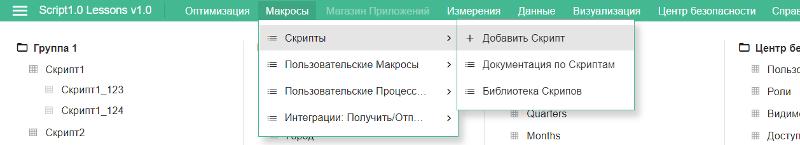
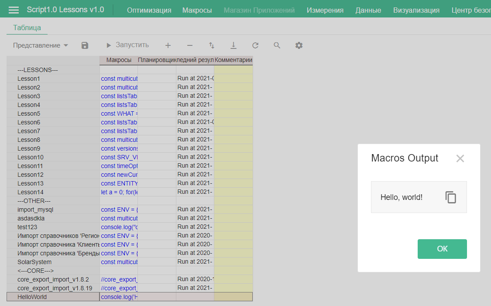
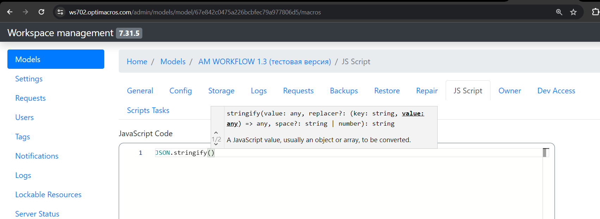

# Hello, world!

Условно считается, что доступ к некоторой модели уже есть. Если доступа нет, нужно его [получить](../appendix/needHelp.md).

Необходимо попробовать написать и запустить на исполнение первый скрипт. Для этого Optimacros предоставляет два варианта интерфейса: внутри модели и через админку.

## Внутри модели

Так выглядит панель управления скриптами:


Описание кнопок:


Следует открыть модель, далее нажать `Макросы` -> `Скрипты` -> `Добавить скрипт`.



В появившемся окне ввести имя скрипта (можно не указывать расширение) и указать его будущую позицию в общем списке всех скриптов модели.


После нажатия «ОК» откроется окно со списком скриптов, выбрать необходимый, кликнуть на ячейку в столбце «`Макросы`», кликнуть ещё раз по появившемуся троеточию и откроется поле ввода текста скрипта:


Ввести в поле код:

```js
console.log('Hello, world!');

```

и нажать «ОК». При этом текст скрипта сохранится внутри модели.

Для запуска необходимо выделить скрипт в списке (для этого нужно нажать на заголовок строки) и на панели инструментов нажать «`Запустить`».



## В админке

Разрабатывать скрипты и предварительно запускать их можно во встроенной в админпанель IDE, однако это доступно только для пользователей с [`правами администратора`](../appendix/needHelp.md) воркспейса.

Для начала нужно открыть список моделей: меню пользователя > `Панель воркспейса` > `Models`. Затем найти нужную модель, нажать `Open` и в открывшейся модели перейти в раздел `Macros`. Здесь настроена IDE для написания и запуска скриптов:



Набрать в ней тот же самый код:


и нажать `Run`. Появится вывод скрипта:


[Курс молодого бойца](cookBook.md)

[Оглавление](../README.md)
