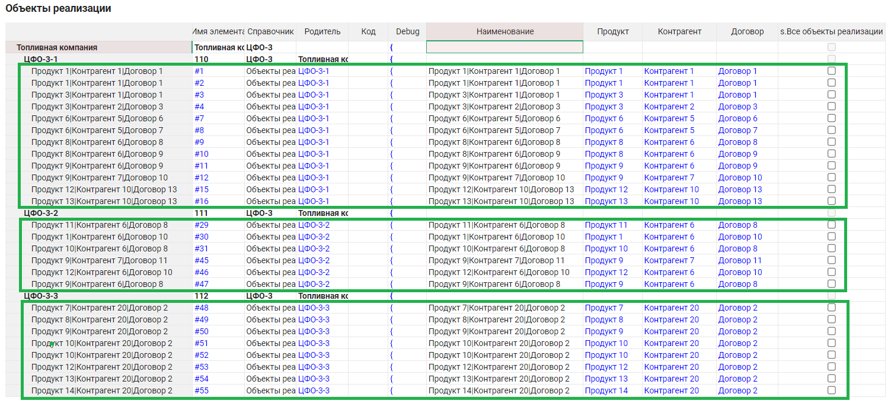
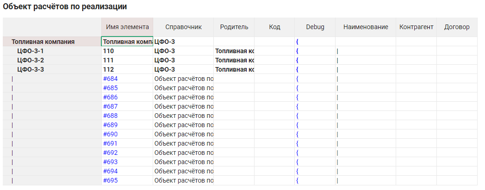
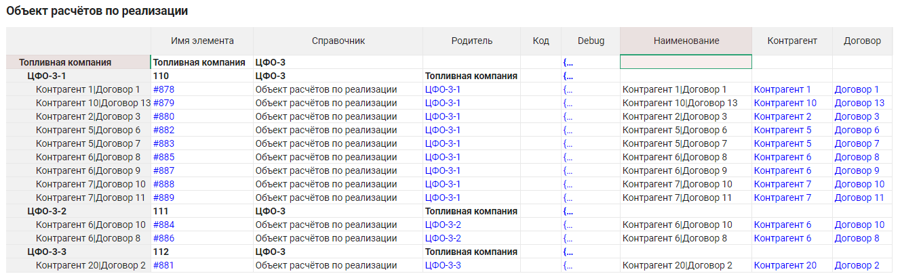

# Разбор скрипта Свёртка справочника

## Постановка задачи

Скрипт выполняет свёртку справочника-источника `SRC_LIST` по свойству `REDUCE_BY` в справочник-приёмник `DST_LIST`. Элементы `SRC_LIST` считаются эквивалентными, если у них совпадает набор свойств `PROPERTIES`. Группа эквивалентных элементов `SRC_LIST` копируется в один элемент `DST_LIST` без свойства `REDUCE_BY`. Элементы справочника SRC_LIST обязательно являются дочерними для элементов другого справочника, но не могут сами являться родительскими.

Кроме того, если задан параметр `NAME_PROPERTY`, для него скрипт, перебирая `PROPERTIES`, устанавливает формулу Optimacros вида
`TEXT('PROPERTY_1') & "|" & TEXT('PROPERTY_2') & "|" & TEXT('PROPERTY_N')`.

## Скрипт вызова

Скрипт вызова содержит объект `ENV` настроек с комментариями для моделлеров и код вызова основного скрипта. Эта механика разобрана в [уроке о цепочках скриптов](./scriptChains.md):

```js
const ENV = {
	CORE: 'Свёртка_справочника_CORE',
	
	// Название справочника-источника
	SRC_LIST: 'Объекты реализации',
	// Свойства, определяющие эквивалентность элементов
	PROPERTIES: ['Контрагент', 'Договор'],
	// Свойство, по которому происходит свёртка
	REDUCE_BY: 'Продукт',
	// Свойство для назначения формулы. Необязательный параметр
	NAME_PROPERTY: 'Наименование',
	
	// Название справочника-приёмника
	DST_LIST: 'Объект расчётов по реализации'
};

om.common
	.resultInfo()
	.actionsInfo()
	.makeMacrosAction(ENV.CORE)
	.appendAfter()
	.environmentInfo()
	.set('ENV', ENV);
```

## Общий план работы

Поскольку по условию все элементы справочника-источника являются дочерними к элементам третьего справочника, и в справочнике-приёмнике их нужно добавить также дочерними для тех же самых элементов, то логически задачу можно рассматривать как набор аналогичных задач для групп элементов с общим родителем, выделенных зелёным на нашем примере исходных данных:



Однако вместо этого можно включить свойство `'Parent'` в массив свойств проверки эквивалентности, и тогда задачу можно решать однократно для всех элементов. Исходное состояние справочника-приёмника такое:


## Начало работы

Основной скрипт начинается с номера версии, чтения объекта настроек `ENV` из [переменной окружения](../API/env.md#environment) и стандартной для всех цепочечных скриптов проверки на то, что он корректно считался:

```js
// v1.1

const ENV = om.environment.get('ENV');

if (!ENV) {
	throw new Error('ENV not defined');
}
```

Далее мы сохраняем ссылку на вкладку справочника-приёмника для будущего использования и устанавливаем свойство `NAME_PROPERTY` задавая в настройках таблицы [фильтрацию](../API/views.md#pivot) и по строкам, и по столбцам, после чего в ней остаётся одна ячейка, поэтому можно не пользоваться [`CellBuffer`](../API/common.md#cell-buffer):

```js
const dstListTab = om.lists.listsTab().open(ENV.DST_LIST);

// Set formula for NAME_PROPERTY
if (ENV.NAME_PROPERTY) {
	om.common.requestInfo().logStatusMessage(`Setting formula for ${ENV.NAME_PROPERTY}`, true);
	for (const chunk of dstListTab.customPropertiesTab().pivot().rowsFilter(ENV.NAME_PROPERTY).columnsFilter('Formula').create().range().generator()) {
		chunk.cells().first().setValue(ENV.PROPERTIES.map((prop) => "TEXT('" + prop + "')").join(' & "|" & '));
	}
}
```

Здесь для решения отдельной задачи задания формулы мы воспользовались оригинальным значением `PROPERTIES`. Теперь можем добавить в неё свойство `'Parent'`:

```js
ENV.PROPERTIES.push('Parent');
```

## Чтение исходных данных

Теперь нужно считать из справочника-источника свойства `PROPERTIES`. Однако, свойство `'Parent'` – особое: функция [`Cell.getValue()`](../API/views.md#cell.get-value) считает отображаемое свойство, которое настраивается в свойствах родительского справочника, а для установки этого свойства нужно записать имя `'Item Name'` родительского элемента, которое можно получить функцией [`Cell.getContextValue()`](../API/views.md#cell.get-context-value).

Например, для элемента `#1` на клетке `'Parent'` функция `Cell.getValue()` вернёт `'ЦФО-3-1'`, а функция `Cell.getContextValue()` вернёт `'ЦФО-3-1||110'`, где `'110'` – `'Item Name'` элемента `'ЦФО-3-1'` в родительском справочнике `Объекты реализации`. Однако, при установке значения в ячейку `'Parent'` впоследствии можно вставлять именно значение `'ЦФО-3-1||110'`.

Поэтому получаем вот такой код чтения справочника-источника:

```js
// Read data
om.common.requestInfo().logStatusMessage(`Reading source list`, true);
const pivot = om.lists.listsTab().open(ENV.SRC_LIST).pivot().columnsFilter(ENV.PROPERTIES.concat(['List']));
const srcListData = [];

for (const chunk of pivot.create().range().generator()) {
	chunk.rows().all().forEach(rowLabels => {
		const rowName = rowLabels.first().name();
		
		const elem = {};
		for (const cell of rowLabels.cells().all()) {
			const col = cell.columns().first().name();
			
			if (col === 'Parent') {
				elem[col] = cell.getContextValue();
			} else {
				elem[col] = cell.getValue();
			}
		}
		
		// Skip parent elements from other lists
		if (elem.List === ENV.SRC_LIST) {
			srcListData.push(elem);
		}
	});
}
```

Отметим ещё, что в дополнение к уже расширенному массиву `PROPERTIES`, мы добавляем в фильтр по столбцам поле 'List', чтобы в конце цикла отфильтровать элементы, находящиеся в родительском справочнике и не добавлять их в массив `srcListData`, который теперь будет выглядеть так:

```js
[
  {
    "List": "Объекты реализации",
    "Parent": "ЦФО-3-1||110",
    "Контрагент": "Контрагент 1",
    "Договор": "Договор 1"
  },
  {
    "List": "Объекты реализации",
    "Parent": "ЦФО-3-1||110",
    "Контрагент": "Контрагент 1",
    "Договор": "Договор 1"
  },
	
	// ...
	
  {
    "List": "Объекты реализации",
    "Parent": "ЦФО-3-3||112",
    "Контрагент": "Контрагент 20",
    "Договор": "Договор 2"
  },
  {
    "List": "Объекты реализации",
    "Parent": "ЦФО-3-3||112",
    "Контрагент": "Контрагент 20",
    "Договор": "Договор 2"
  }
]
```

## Собственно свёртка

Следующим шагом нужно удалить оказавшиеся эквивалентными элементы массива `srcListData`. Это можно сделать двумя способами:

1. Для каждого элемента массива просматривать все последующие и удалять совпадения. [`Вычислительная сложность`](https://tproger.ru/articles/computational-complexity-explained/) такого алгоритма: O(n<sup>2</sup>).

1. Отсортировать массив и применить предыдущий алгоритм с учётом того, что эквивалентные элементы могут находиться только рядом друг с другом. Сложность сортировки: O(n log n), сложность второго этапа O(n), итого сложность алгоритма: O(n log n + n) = O(n log n) < O(n<sup>2</sup>).

Исходя из анализа вычислительной сложности, выбираем второй вариант. Для использования стандартной функции [`sort()`](https://developer.mozilla.org/ru/docs/Web/JavaScript/Reference/Global_Objects/Array/sort) нужно реализовать функцию сравнения элементов:

```js
function compare(a, b) {
	for (let i = 0; i < ENV.PROPERTIES.length; i++) {
		if (a[ENV.PROPERTIES[i]] < b[ENV.PROPERTIES[i]]) {
			return -1;
		} else if (a[ENV.PROPERTIES[i]] > b[ENV.PROPERTIES[i]]) {
			return 1;
		}
	}
	
	return 0;
}
```

Оповещаем пользователя о начале, возможно, длительного процесса и вызываем функцию сортировки:

```js
om.common.requestInfo().logStatusMessage(`Reducing by property '${ENV.REDUCE_BY}'`, true);
srcListData.sort(compare);
```

Приступаем ко второму этапу. Для каждого элемента массива будем перебивать следующие за ним подряд эквивалентные ему (в смысле набора свойств `PROPERTIES`). Обратим внимание на два момента. Во-первых, более эффективно не удалять такие элементы по одному, а посчитать их количество и затем удалить все однократным вызовом функции [`splice()`](https://developer.mozilla.org/ru/docs/Web/JavaScript/Reference/Global_Objects/Array/splice). А во-вторых, несмотря на наличие вложенного цикла, перебор элементов ведётся строго слева направо, поэтому сложность алгоритма – линейная, то есть O(n).

```js
let i = 0;
while (i < srcListData.length - 1) {
	const a = srcListData[i];
	
	let j = i + 1;
	while (j < srcListData.length && compare(a, srcListData[j]) === 0) {
		++j;
	}
	
	srcListData.splice(i + 1, j - 1 - i);
	++i;
}
```

Теперь `srcListData` будет выглядеть так:

```js
[
  {
    "List": "Объекты реализации",
    "Parent": "ЦФО-3-1||110",
    "Контрагент": "Контрагент 1",
    "Договор": "Договор 1"
  },
  {
    "List": "Объекты реализации",
    "Parent": "ЦФО-3-1||110",
    "Контрагент": "Контрагент 2",
    "Договор": "Договор 3"
  },
	// ...
  {
    "List": "Объекты реализации",
    "Parent": "ЦФО-3-2||111",
    "Контрагент": "Контрагент 6",
    "Договор": "Договор 10"
  },
  {
    "List": "Объекты реализации",
    "Parent": "ЦФО-3-3||112",
    "Контрагент": "Контрагент 20",
    "Договор": "Договор 2"
  }
]
```

## Запись результата

Теперь, когда в оперативной памяти свёртка произведена, нужно отправить изменения на сервер Optimacros. Для начала создадим нужное количество элементов в справочнике-приёмнике:

```js
// Insert into destination list
om.common.requestInfo().logStatusMessage(`Inserting into destination list '${ENV.DST_LIST}'`, true);
const createdElems = dstListTab
	.elementsCreator()
	.numeric()
	.setCount(srcListData.length)
	.create();
```

Сейчас все эти элементы пустые, и если на этом месте остановить скрипт, мы увидим, что все они добавились в конец, не попав ни к кому в качестве дочерних:



Отфильтровав справочник по созданным элементам на строках и по `PROPERTIES` на столбцах, заполняем значения свойств:

```js
let ind = 0;
const cb = om.common.createCellBuffer().canLoadCellsValues(false);
for (const chunk of dstListTab.pivot().columnsFilter(ENV.PROPERTIES).rowsFilter(createdElems).create().range().generator()) {
	chunk.rows().all().forEach(rowLabels => {
		for (const cell of rowLabels.cells().all()) {
			const col = cell.columns().first().name();
			cb.set(cell, srcListData[ind][col]);
		}

		ind++;
	});
}
cb.apply();
```

Выводим последнее сообщение радости пользователю:

```js
console.log(`Well done!`);
```

После выполнения скрипта видим его вывод:

```
Setting formula for Наименование
Reading source list
Reducing by property 'Продукт'
Inserting into destination list 'Объект расчётов по реализации'
Well done!
```

... и результат:



**Полный текст**: [Скрипт](./scripts/reduceLists_CORE.js) и [пример](./scripts/reduceLists_ENV.js) его настроек.

[Курс молодого бойца](cookBook.md)

[Оглавление](../README.md)
