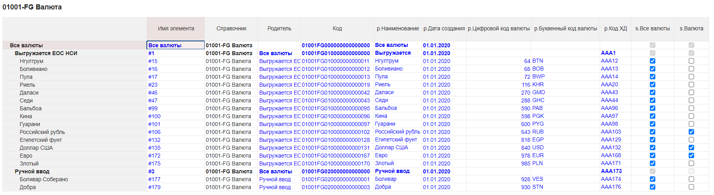
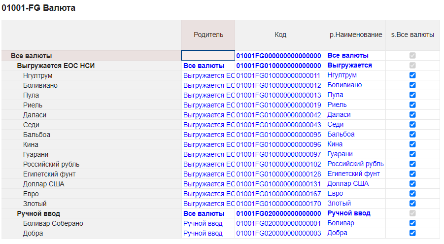
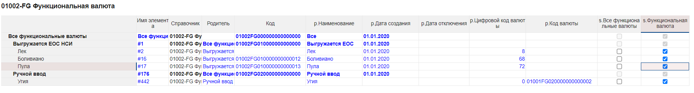
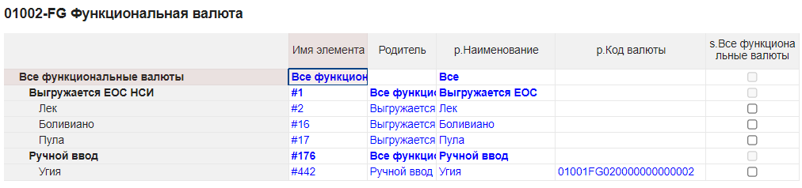
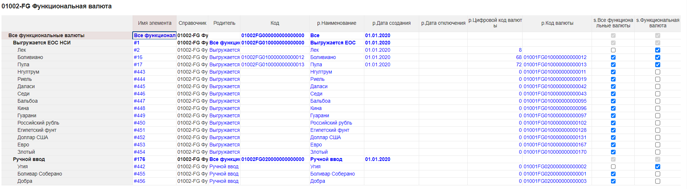

# Разбор скрипта Частичное копирование справочников

Скрипт копирует из справочника `SRC_LIST` в справочник `DST_LIST` только поля `SRC_PROPS` в поля `DST_PROPS` соответственно. Начальные элементы обоих массивов считаются уникальными идентификаторами элементов каждого справочника. По этим полям происходит сопоставление элементов справочников. Если в приёмнике элемент отсутствует, он будет создан. Массивы `SRC_EXC` и `DST_EXC` задают элементы обоих справочников, которые должны быть проигнорированы.

Скрипт вызова содержит объект `ENV` настроек с комментариями для моделлеров и код вызова основного скрипта. Эта механика разобрана в [уроке о цепочках скриптов](./scriptChains.md):

```js
const ENV = {
	CORE: 'ЧастичноеКопированиеСправочника',
	
	// Названия справочника-источника
	SRC_LIST: '01001-FG Валюта',
	// Названия справочника-приёмника
	DST_LIST: '01002-FG Функциональная валюта',
	// Параллельные массивы свойств. Каждое свойство источника копируется в соответствующее свойство приёмника.
	// Начальный элемент каждого массива - идентификатор элемента в справочнике. Он должен быть уникальным.
	SRC_PROPS: ['p.Наименование', 'Parent', 'Code', 's.Все валюты'],
	DST_PROPS: ['p.Наименование', 'Parent', 'p.Код валюты', 's.Все функциональные валюты'],
	// Элементы источника, которые скрипт пропускает
	SRC_EXC: ['Все валюты', 'Выгружается ЕОС НСИ', 'Ручной ввод'],
	// Элементы приёмника, которые скрипт пропускает
	DST_EXC: ['Все функциональные валюты', 'Выгружается ЕОС НСИ', 'Ручной ввод']
};

om.common
	.resultInfo()
	.actionsInfo()
	.makeMacrosAction(ENV.CORE)
	.appendAfter()
	.environmentInfo()
	.set('ENV', ENV);
```

Общий план работы таков: скрипт считывает справочник-источник, затем читает справочник-приёмник, попутно соспоставляя элементы и исправляя те, в которых свойства совпадают не полностью. Затем, если не удалось сопоставить все элементы источника, создаётся недостающее количество элементов в приёмнике, и у них устанавливаются нужные свойства.

Основной скрипт начинается с номера версии, чтения объекта настроек `ENV` из [переменной окружения](../API/env.md#environment), стандартной для всех цепочечных скриптов проверки на то, что он корректно считался, и специфичной для этого скрипта проверки на то, что массивы названий свойств двух справочников одинаковой длины:

```js
// v1.0

const ENV = om.environment.get('ENV');

if (!ENV) {
	throw new Error('ENV not defined');
}

if (ENV.SRC_PROPS.length !== ENV.DST_PROPS.length) {
	throw new Error('Списки свойств приёмника и источника разной длины!');
}
```

Последняя проверка необходима потому, что скрипт не сопоставляет свойства разных справочников по именам, а может копировать свойство `'p1'` справочника `L1` в свойство `'p2'` справочника `L2`.

Далее объявлена функция `readGrid(pivot, gridData, idCol, exc)`, которая читает табличные данные из представления `pivot`, пропускает элементы, где значение в столбце `idCol` является одним из исключений `exc`, и добавляет их как объекты в массив `gridData`. Здесь используется материал [`предыдущих уроков`](./cellsAccess.md) и функция JavaScript [`findIndex()`](https://developer.mozilla.org/ru/docs/Web/JavaScript/Reference/Global_Objects/Array/findIndex).

```js
function readGrid(pivot, gridData, idCol, exc) {
	for (const chunk of pivot.create().range().generator()) {
		chunk.rows().all().forEach(rowLabels => {
			const elem = {};

			for (const cell of rowLabels.cells().all()) {
				const col = cell.columns().first().name();
				elem[col] = cell.getValue();
			}
			
			if (exc.findIndex(ex => elem[idCol] === ex) === -1) {
				gridData.push(elem);
			}
		});
	}
}
```

После этого начинается основная работа скрипта. Сначала целиком считывается справочник-источник:

```js
// Get source list tab
const srcListTab = om.lists.listsTab().open(ENV.SRC_LIST);
let srcData = [];
om.common.requestInfo().logStatusMessage(`Reading source list`, true);
readGrid(srcListTab.pivot().columnsFilter(ENV.SRC_PROPS), srcData, ENV.SRC_PROPS[0], ENV.SRC_EXC);
```

Здесь заметим, что используется функция [`logStatusMessage()`](../API/common.md#request-manager.log-status-message), которая информирует пользователя о происходящем этапе работы и одновременно отправляет сообщение в вывод скрипта. И что таблица справочника считывается не целиком, а фильтруется по именам свойств, заданных в настройках `ENV`. В нашем примере справочник-источник выглядит так:



Однако с учётом фильтрации таблица будет считана, как будто если бы она выглядела так:



Далее начинается следующий крупный этап: чтение справочника-приёмника и одновременная перезапись свойств тех элементов приёмника, которые успешно сопоставились с элементами источника, но не идентичны им в смысле заданных массивов свойств:

```js
// Get destination list tab
const dstListTab = om.lists.listsTab().open(ENV.DST_LIST);
const cb = om.common.createCellBuffer().canLoadCellsValues(false);
let propNameMap = {};
om.common.requestInfo().logStatusMessage(`Reading destination list and changing existing items`, true);
```

В нашем примере справочник-приёмник выглядит так:



После инициализации этапа начинается привычный цикл прохода по ячейкам таблицы:

```js
for (const chunk of dstListTab.pivot().columnsFilter(ENV.DST_PROPS.concat(['Item Name'])).create().range().generator()) {
	chunk.rows().all().forEach(rowLabels => {
		// ...
	});
}
```

C учётом фильтрации (заметим, что дополнительно включается столбец с именем) приёмник будет выглядеть так:



В начале работы цикла мы читаем очередную строку следующим образом:

```js
// Read destination row
const elem = {};
let itemName, idProp;
for (const cell of rowLabels.cells().all()) {
	const col = cell.columns().first().name();
	elem[col] = cell.getValue();
	
	if (col === 'Item Name') {
		itemName = cell.getValue();
	} else if (col === ENV.DST_PROPS[0]) {
		idProp = cell.getValue();
	}
}
propNameMap[idProp] = itemName;
```

Здесь мы создаём объект `elem`, где ключами являются наименования столбцов, а значениями – данные в таблице, и дополнительно сохраняем имя элемента и нулевое свойство (которое является идентифицирующим) из списка `ENV.DST_PROPS` заданных для копирования. Последней строкой этого куска между ними устанавливается соответствие с помощью объекта `propNameMap`, который нам пригодится позднее. Отметим лишь, что выглядеть он будет вот так:

```js
{
  "Все функциональные валюты": "Все функциональные валюты",
  "Выгружается ЕОС НСИ": "#1",
  "Лек": "#2",
  "Боливиано": "#16",
  "Пула": "#17",
  "Ручной ввод": "#176",
  "Угия": "#442"
}
```

Если элемент в списке исключения, он пропускается аналогично тому, как это делается для исключений источника:

```js
// Exclude if needed
if (ENV.DST_EXC.findIndex(ex => elem[ENV.DST_PROPS[0]] === ex) !== -1) {
	return;
}
```

После этого ищем элемент источника, совпадающий с только что прочитанным элементом приёмника по нулевому свойству (в нашем случае и у источника, и у приёмника это `'p.Наименование'`):

```js
const sameIdInd = srcData.findIndex(e => e[ENV.SRC_PROPS[0]] === elem[ENV.DST_PROPS[0]]);

if (sameIdInd === -1) {
	return;
}
```

Если в приёмнике такого элемента нет, мы пропускаем элемент источника – он останется без соответствия, так как по заданию нет указания удалять элементы приёмника. Если же соответствие нашлось, мы должны выяснить, полное ли оно. Для этого проверим на равенство остальные свойства. Заметим, что переменная цикла инициализируется единицей, так как нулевое свойство уже проверено:

```js
// Check total equivalence
let eq = true;
for (let i = 1; i < ENV.SRC_PROPS.length; ++i) {
	if (srcData[sameIdInd][ENV.SRC_PROPS[i]] !== elem[ENV.DST_PROPS[i]]) {
		eq = false;
		break;
	}
}
```

Если элементы эквивалентны в смысле переданных списков свойств, делать ничего не нужно. Если же не совпадают какие-то свойства, перезапишем все свойства, кроме нулевого, с помощью [`CellBuffer`](../API/common.md#cell-buffer):

```js
if (! eq) {
	// Replace all properties except id property
	for (const cell of rowLabels.cells().all()) {
		const dstCol = cell.columns().first().name();
		
		if (dstCol !== ENV.DST_PROPS[0]) {
			const colInd = ENV.DST_PROPS.indexOf(dstCol);
			cb.set(cell, srcData[sameIdInd][ENV.SRC_PROPS[colInd]]);
		}
	}
}
```

Вне зависимости от наличия полного соответствия теперь соответствующий элемент приёмника можно [удалить](https://developer.mozilla.org/ru/docs/Web/JavaScript/Reference/Global_Objects/Array/splice) из массива, чем ускорить поиск следующих соответствий в дальнейших итерациях цикла:

```js
// Delete processed element form srcData
srcData.splice(sameIdInd, 1);
```

На этом цикл обработки приёмника заканчивается, и мы отправляем накопленные изменения на сервер и уведомляем пользователя:

```js
const c = cb.count() / ENV.DST_PROPS.length;
cb.apply();
console.log(`${c} existing items changed \n`);
```

Удаление элементов из `srcData` приводит не только к увеличению эффективности поиска соответствий, но и к тому, что по окончании цикла в этом массиве останутся только те элементы, соответствия которым не нашлось. Это значит, что именно их и нужно создать в справочнике-приёмнике. Но если элементов в массиве не осталось, это значит, что создавать нечего, и нужно лишь вывести уведомление для пользователя:

```js
if (srcData.length > 0) {
	// ...
} else {
	console.log(`No new items needed \n`);
}
```

Для нашего случая `srcData` теперь будет выглядеть так:

```js
[
	{
		"Parent": "Выгружается ЕОС НСИ",
		"Code": "01001FG010000000000011",
		"p.Наименование": "Нгултрум",
		"s.Все валюты": "true"
	},
	{
		"Parent": "Выгружается ЕОС НСИ",
		"Code": "01001FG010000000000019",
		"p.Наименование": "Риель",
		"s.Все валюты": "true"
	},
	{
		"Parent": "Выгружается ЕОС НСИ",
		"Code": "01001FG010000000000042",
		"p.Наименование": "Даласи",
		"s.Все валюты": "true"
	},
	{
		"Parent": "Выгружается ЕОС НСИ",
		"Code": "01001FG010000000000043",
		"p.Наименование": "Седи",
		"s.Все валюты": "true"
	},
	{
		"Parent": "Выгружается ЕОС НСИ",
		"Code": "01001FG010000000000095",
		"p.Наименование": "Бальбоа",
		"s.Все валюты": "true"
	},
	{
		"Parent": "Выгружается ЕОС НСИ",
		"Code": "01001FG010000000000096",
		"p.Наименование": "Кина",
		"s.Все валюты": "true"
	},
	{
		"Parent": "Выгружается ЕОС НСИ",
		"Code": "01001FG010000000000097",
		"p.Наименование": "Гуарани",
		"s.Все валюты": "true"
	},
	{
		"Parent": "Выгружается ЕОС НСИ",
		"Code": "01001FG010000000000102",
		"p.Наименование": "Российский рубль",
		"s.Все валюты": "true"
	},
	{
		"Parent": "Выгружается ЕОС НСИ",
		"Code": "01001FG010000000000128",
		"p.Наименование": "Египетский фунт",
		"s.Все валюты": "true"
	},
	{
		"Parent": "Выгружается ЕОС НСИ",
		"Code": "01001FG010000000000131",
		"p.Наименование": "Доллар США",
		"s.Все валюты": "true"
	},
	{
		"Parent": "Выгружается ЕОС НСИ",
		"Code": "01001FG010000000000167",
		"p.Наименование": "Евро",
		"s.Все валюты": "true"
	},
	{
		"Parent": "Выгружается ЕОС НСИ",
		"Code": "01001FG010000000000170",
		"p.Наименование": "Злотый",
		"s.Все валюты": "true"
	},
	{
		"Parent": "Ручной ввод",
		"Code": "01001FG020000000000001",
		"p.Наименование": "Боливар Соберано",
		"s.Все валюты": "true"
	},
	{
		"Parent": "Ручной ввод",
		"Code": "01001FG020000000000003",
		"p.Наименование": "Добра",
		"s.Все валюты": "true"
	}
]
```

При создании новых элементов важно учитывать, что у них должен быть тот же родитель, что и в источнике. Сделать это можно двумя способами: непосредственно перед созданием указать [`longId`](../API/views.md#long-id) родителя для каждого элемента (или для каждой группы) с помощью функции [`BaseElementsCreator.setPositionChildOf()`](../API/elementsManipulator.md#base-elements-creator.set-position-child-of) или после создания задать свойство `'Parent'`. В первом случае нужно знать [`longId`](../API/views.md#long-id) родителя, а во втором – его свойство `'Item Name'`.  Но у соответствующих элементов источника и приёмника не совпадает ни то, ни другое. Здесь и приходит на помощь объект `propNameMap` – он устанавливает соответствие нулевого свойства (которое по условие тоже является уникальным) и `'Item Name'`. Здесь мы выбираем второй способ, потому что он проще: не нужно собирать элементы в группы и создавать их по отдельности, а установить свойство `'Parent'` можно будет в цикле простановки остальных свойств.

Меняем с помощью `propNameMap` отображаемое наименование родителя элемента источника на его `'Item Name'`:

```js
om.common.requestInfo().logStatusMessage(`Mapping parents`, true);
for (let elem of srcData) {
	elem.Parent = propNameMap[elem.Parent];
}
```

Получаем изменённый массив `srcData` (показаны только последние 3 элемента):

```js
[
	...,
	{
		"Parent": "#1",
		"Code": "01001FG010000000000170",
		"p.Наименование": "Злотый",
		"s.Все валюты": "true"
	},
	{
		"Parent": "#176",
		"Code": "01001FG020000000000001",
		"p.Наименование": "Боливар Соберано",
		"s.Все валюты": "true"
	},
	{
		"Parent": "#176",
		"Code": "01001FG020000000000003",
		"p.Наименование": "Добра",
		"s.Все валюты": "true"
	}
]
```

Теперь мы [создаём](../API/elementsManipulator.md#numeric-elements-creator) элементы справочника-приёмника:

```js
om.common.requestInfo().logStatusMessage(`Creating new items`, true);
const newElems = dstListTab.elementsCreator().numeric().setCount(srcData.length).create();
console.log(`${newElems.length} new items created \n`);
```

И выставляем им все свойства согласно массиву `srcData`:

```js
om.common.requestInfo().logStatusMessage(`Setting properties for new items`, true);
let ind = 0;
for (const chunk of dstListTab.pivot().columnsFilter(ENV.DST_PROPS).rowsFilter(newElems).create().range().generator()) {
	chunk.rows().all().forEach(rowLabels => {
		for (const cell of rowLabels.cells().all()) {
			const col = cell.columns().first().name();
			const colInd = ENV.DST_PROPS.indexOf(col);
			cb.set(cell, srcData[ind][ENV.SRC_PROPS[colInd]]);
		}
		++ind;
	});
}
cb.apply();
```

Выводим последнее сообщение радости пользователю:

```js
console.log(`Well done! \n`);
```

После выполнения скрипта видим его вывод:

```
Reading source list
Reading destination list and changing existing items
2 existing items changed 
Mapping parents
Creating new items
14 new items created 
Setting properties for new items
Well done! 
```

... и результат:



Два существовавших изменённых элемента – это `'Боливиано'` и `'Пула'`, так как у них не было установлено свойство `'p.Код валюты'`. 14 созданных элементов: `'Нгултрум'`, `'Риель'`, ..., `'Злотый'` с родителем `'Выгружается ЕОС НСИ'`, а также `'Боливар Соберано'` и `'Добра'` с родителем `'Ручной ввод'`.

**Полный текст**: [Скрипт](./scripts/partialListCopy_v1.0.js) и [пример](./scripts/partialListCopy_ENV.js) его настроек.

[Курс молодого бойца](cookBook.md)

[Оглавление](../README.md)
