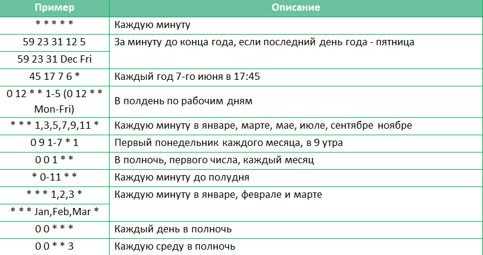

# Cron-формат:

Cron-формат это простой, но мощный и гибкий способ описания времени и периодичности действий.
Традиционный cron-формат состоит из пяти полей, разделенных пробелами:
<Минуты> <Часы> <Дни_месяца> <Месяцы> <Дни_недели>
```
   * * * * *
   | | | | |
   | | | | +----- Дни недели (диапазон: 1-7)
   | | | +------- Месяцы (диапазон: 1-12)
   | | +--------- Дни месяца (диапазон: 1-31)
   | +----------- Часы (диапазон: 0-23)
   +------------- Минуты (диапазон: 0-59)
```

Любое из пяти полей может содержать символ * (звездочка) в качестве значения. Это означает полный диапазон возможных 
значений, например, каждая минута, каждый час и т. д. Любое из полей может содержать список значений, разделенных 
запятыми (например, 1,3,7) или интервал (поддиапазон) значений, обозначаемый дефисом (например, 1-5). После звездочки 
(*) или интервала можно с помощью символа / указать шаг значений. Например, 0-23/2 может использоваться в поле "Часы"
 для указания того, что действие должно происходить каждые два часа (альтернатива из старого варианта -
  0,2,4,6,8,10,12,14,16,18,20,22), значение */4 в поле "Минуты" означает, что действие, должно происходить каждые 
 четыре минуты, 1-30/3 - это то же, что и 1,4,7,10,13,16,19,22,25,28. В полях "Месяцы" и "Дни недели" можно вместо 
 числовых значений использовать сокращенные до трех букв названия месяцев (Jan, Feb ... Dec) и дней недели 
 (Mon, Tue ... Sun).
 
  


[Вернуться к введению](getting-started.md)

[Вернуться к оглавлению](index.md)

