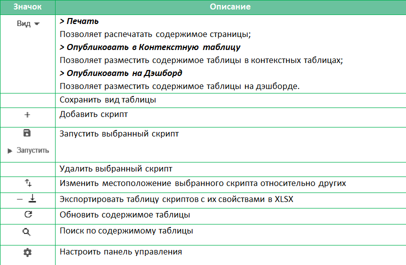

# Интерфейсы для написания и запуска скриптов

## Внутри модели

Для создания и написания скриптов нужно перейти в главном меню приложения в пункт меню: 
Макросы > Скрипты

Так выглядит панель управления скриптами:

Описание кнопок:

Кнопка "Добавить скрипт" отобразит модальное окно добавления скрипта, где можно указать название для нового скрипта и
позицию его вставки в таблицу относительно текущего выделения:

Для редактирования скрипта выделите ячейку напротив вашего скрипта в колонке "Макросы" и нажмите на троеточие. Откроется текстовое поле для ввода кода скрипта:
 

Для запуска скрипта нужно выделить его строку и нажать кнопку "Запустить" на панели управления.
 
## В админке

Разрабатывать скрипты и предварительно запускать их можно во встроенной в админпанель IDE, однако это доступно только для пользователей с правами администратора воркспейса.

Для начала нужно открыть список моделей: меню пользователя > "Панель воркспейса" > Models. Затем найти нужную модель, нажать "Open" и в открывшейся модели перейти в раздел "Macros":
 
 
 
Раздел Sheduler позволяет установливать запуск скриптов по расписанию в **Cron-формате**. Подробнее почитать о Cron-формате можете [>> ЗДЕСЬ](cronFormat.md). 
 
Строка Last отображает время последнего запуска скрипта и результат исполнения.

[Начало работы](gettingStarted.md)

[Оглавление](README.md)