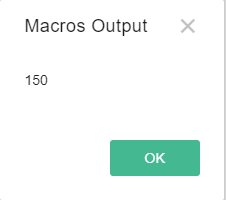

# Введение:

Данный мануал служит для организации ведения технической документации, функций, классов, вызовов, поддерживаемых
 функционалом скриптов/макросов на проекте Optimacros. Написание скриптов осуществляется на языке программирования
  JavaScript V8 (V8 – движок/интерпретатор, считывающий и исполняющий исходный код на JavaScript). С обучающими 
  материалы по JavaScript можно ознакомиться по ссылке https://developer.mozilla.org/ru/docs/Web/JavaScript
  
  В коде допускаются комментарии. Комментарии должны обозначаться специальными символами:
  -	/* комментарий с переносом 
  строки*/
  -	// комментарий 

  
  Скрипты разделяются на обычные, интеграционные и комбинированные. 
  
  Обычные скрипты действуют внутри модели. 
  
  Интеграционные – за пределами модели, позволяют забирать или передавать с FTP или DWH (OLTP) данные или команды 
  (запросы SELECT, UPDATE и т.п.).
   
  Комбинированные – совмещают возможности обычных и интеграционных скриптов. различные 
  операции или манипуляции в системе. От 
  простых математических вычеслений, до сложных копированияй мультикубов с их содержимым из одной моделли в другую. 
  
  На пример:
```ts
var a = 10; // Объявили переменную под названием a и присвоили ей значение 10
var b = 15; // Объявили переменную под названием b и присвоили ей значение 15
print(a * b); // Выводим результат произведения значений переменных a и b
```

Такое содержимое скрипта произведёт указанную нами математическую операцию и выведет результат в модальном окне прямо в
 системе.

Вывод будет следующим:



Для создания и написания скриптов, нужно перейти в главном меню приложения в пункт меню: 
Macros/Максроы > Scripts/Скрипты

Так выглядит панель управления скриптами:


Описание кнопок:


Нажав на кнопку "Добавить скрипт" модальное окно обавления скрипта, где Вы сможете указать название для нового скрипта и
позицию его вставки в данной таблице, относительно Вашего текущего выделения. Модальное окно выглядит вот так:


После создания нового скрипта Вы увидите его в таблице, на указанной Вами позиции. Для добавления или редактирования
 сценариев или инструкций, которые будет выполнять скрипт, выделите ячейку напротив вашего скрипта в колонке Macros и
 затем нажмите на троеточие. После чего откроется (textarea/тектовое поле) для ввода сценария. Рисунок ниже:
 
 
 
Разрабатывать скрипты и предварительно запускать их можно во встроенной в админпанели IDE, зайдя в раздел моделей и
 перейдя в одну из них, будет доступна вкладка Macros (Доступно только для Администраторов).
 
 
 
 Итак мы уже знаем для чего нужна колонка Macros, переходим к колонке Sheduler, которая позволяет нам установливать 
 запуск скриптов по расписанию в **Cron-формате**. Подробнее почитать о Cron-формате можете [>> ЗДЕСЬ](cronFormat.md). 
 
 Колонка Last Result отображает время последнего запуска скрипта и результат исполнения.


[Вернуться к оглавлению](index.md)